# Android Agent Harness

[](https://github.com/susyimes/android-agent-harness/actions/workflows/ci.yml)
[](LICENSE)
[](https://github.com/susyimes/android-agent-harness/releases)

<p align="center">
  
</p>

Android Agent Harness is a minimal, provider-neutral agent runtime extracted from the architectural seams of `mirror-android`. It keeps the reusable path and leaves product code behind:

```text
Android UI / JVM demo
        ↓
AgentHarnessRunner
        ↓
AgentOrchestrator
   ├─ AgentContextCoordinator → context adapters
   ├─ AgentProvider           → model/transport adapter
   ├─ AgentToolOrchestrator   → scoped registry → tool adapters
   └─ AgentSessionStore       → persistence adapter
```

## Quickstart — 60 seconds, no Android SDK

All you need is JDK 17. No API key, account, device, emulator, or Android SDK:

```sh
git clone https://github.com/susyimes/android-agent-harness.git
cd android-agent-harness
./gradlew :demo:run          # Windows: .\gradlew.bat :demo:run
```

The deterministic output proves the full context → provider → tool → provider → transcript path:

```text
OUTPUT=Harness result: ANDROID
PROVIDER_STEPS=2
TRACE=ContextLoaded -> ProviderInvoked(1) -> ToolExecuted(uppercase) -> ProviderInvoked(2) -> Completed(2)
TRANSCRIPT=USER:android | TOOL:ANDROID | ASSISTANT:Harness result: ANDROID
```

To supply different public demo text:

```sh
./gradlew :demo:run --args="hello android"
```

## Try it on your phone

The `sample` app is an installable APK of the same harness. Every release attaches it, and every CI build of `main` uploads it as the `sample-debug-apk` artifact. Version 0.4 adds a warm, card-based chat UI, explicit provider/model selection, and a cancellable phone-mode turn with an 80-step safety ceiling.

1. **Download** the APK from the [latest release](https://github.com/susyimes/android-agent-harness/releases/latest). It is **debug-signed and sideload-only** — it is not distributed through any app store, so Android will ask you to allow installing from an unknown source. API keys and login tokens are encrypted at rest with an Android Keystore-backed key, but a debuggable APK is still not a production secret boundary: use a low-limit, revocable credential and clear or log out when you are done.
2. **Install and open** it (Android 8.0 / API 26 or newer).
3. **Choose a provider, then chat:**
   - **Offline demo:** no account or key; a deterministic scripted provider runs the full provider → tool → provider loop locally with zero network traffic.
   - **Codex (experimental):** sign in with a ChatGPT account through browser PKCE, with device-code login as a fallback. This is an isolated sample adapter, not an officially documented third-party Android authentication surface.
   - **Kimi Plan:** enter a Coding Plan API key and choose K3, Kimi K2.7 Code, or Kimi K2.6. Requests use the Plan endpoint at `https://api.kimi.com/coding/v1`.
   - **Ark Plan:** enter a Plan API key and choose a supported preset such as Doubao Seed 2.0 Pro, GLM 5.2, MiniMax M3, or DeepSeek V4 Pro. Requests use `https://ark.cn-beijing.volces.com/api/plan/v3`.
   - **Custom compatible endpoint:** configure a base URL, model, and credential for an OpenAI-compatible chat-completions service.

   Provider secrets are stored separately, encrypted at rest, and sent only to the selected provider's configured endpoint. The app migrates the previous sample's plaintext custom credential into encrypted storage and removes the legacy value.
4. **Optionally enable phone mode** to let the model operate your device — read the next section first.

### Phone mode and the accessibility service, honestly

Phone mode gives the agent the `device_observe` / `device_act` / `device_finish` tools backed by a real Android accessibility service. Before you enable it, know exactly what that means:

- **What the service can see.** While the service is enabled, Android grants it the ability to read the content of the foreground window — including other apps and any sensitive text visible on screen. The harness pulls a snapshot only while a phone-mode turn you started is running, and what it reads is the accessibility node tree rendered as text: visible labels, text, roles, and view-id suffixes — at most 60 nodes per snapshot, with each label or text value truncated to 80 characters. There is **no screenshot, screen recording, or image input of any kind** — pixels never reach the model. Whatever text the snapshot contains is sent to the model endpoint you configured.
- **What the service can do.** One action per step, from this set: tap a node, set the text of an editable node, press Back, swipe, scroll until some text is visible, launch an app by name, and wait for the screen to settle. Pressing Home is refused — leaving the current app strands the task — and the agent must finish with `device_finish`, supplying evidence text that is actually visible on the screen it claims to be finishing on. Nothing runs on its own: the loop only moves while a turn you started with **Send** is in progress.
- **You must enable it yourself.** The app cannot and does not switch the service on. Toggling phone mode only opens the system **Settings → Accessibility** screen, where you enable the "Agent Harness" service manually. Phone mode also requires a ready online provider — a valid API key or a current Codex login — because the offline scripted path is chat-only.
- **High-risk actions always stop for a human.** When a target control matches the app's declared risk patterns (pay, purchase, checkout, transfer, delete, uninstall, order confirmation, and the equivalent Chinese terms), the action does not execute. An approval panel appears **on top of whatever app is in front** — it is drawn by the accessibility service, not by this app's window, precisely because the agent is usually driving something else. Only your tap on **Allow** approves. The model-supplied arguments, including any `confirmed=true`, are **ignored entirely**, so the model cannot approve its own action; Deny, the visible countdown expiring, and a missing approval surface all count as refusal, and a refused action is reported to the model in wording that tells it not to retry.
- **Where the safety net has holes.** Risk matching is keyword-based against the control's label, text, and view id, plus a context check that escalates a generic "Confirm"/"OK" button when the surrounding screen looks risky. That is best effort, not a guarantee: a control labelled in another language, or with no meaningful label at all, can slip through. There is no vision fallback either, so canvas-drawn and WebView-heavy screens are largely invisible to the agent.
- **How to turn it off.** Disable the "Agent Harness" service in **Settings → Accessibility** at any time (uninstalling the app also removes it). With the service disabled, phone mode cannot observe or touch anything.

## More demos

The same demo binary has four subcommands beyond the default scripted turn.

```sh
./gradlew :demo:run --args="scenarios"
```

Controlled-context showcase: five deterministic scenarios proving that what the provider may see (trust, priority, content budget), what it may call (tool profile), and how long it may run (step limit) are policy decisions recorded in the trace — untrusted context is dropped before the provider ever sees it, no matter how high its priority.

```sh
export OPENAI_API_KEY=...                        # your own key, read from the environment only
export OPENAI_BASE_URL=https://api.deepseek.com  # optional; DeepSeek example
export OPENAI_MODEL=deepseek-chat                # optional; DeepSeek example
./gradlew :demo:run --args="live"
```

Live: one bounded turn against a real OpenAI-compatible endpoint with three locally implemented tools. `OPENAI_BASE_URL` defaults to the OpenAI endpoint and `OPENAI_MODEL` to `gpt-4o-mini`. Keys never enter the repository: the credential is read from the environment at run time, and the `auditProvenance` task fails the build on any embedded credential-like assignment. Without a key set, the demo prints setup instructions and exits normally without any network traffic.

```sh
./gradlew :demo:run --args="eval"
```

Eval: governed evolution — a candidate overlay over a markdown workspace is compared against the baseline on fixed cases and is promoted only when it improves at least one case and regresses none; a single regression vetoes promotion.

```sh
./gradlew :demo:run --args="phone"
```

Phone: an observe → act → finish loop over a deterministic fake device. The Pay button is configured high-risk, so the first tap pauses for explicit approval instead of executing; the device receives exactly one tap, and only after the approval.

## Requirements

- JDK 17 for everything JVM (`harness-core`, `demo`, all JVM tests)
- Android SDK Platform 36 only for building the Android modules (`device-loop-android`, `sample`)
- No API key, account, device, NDK, or external service

## Validate the repository

JVM-only validation (no Android SDK required):

```sh
./gradlew auditProvenance :harness-core:test :demo:test
```

Full validation including the Android sample build (requires the Android SDK):

```sh
./gradlew checkM0
```

`checkM0` runs the provenance/privacy audit, the JVM unit/end-to-end tests, the provider-catalog tests, the demo tests, and `:sample:assembleDebug`. The Android library's JVM-hosted mapper tests run with `:device-loop-android:testDebugUnitTest` (also requires the SDK).

To install the sample app on a connected Android device or emulator:

```sh
./gradlew :sample:installDebug
```

## Modules

- `harness-core`: pure Kotlin/JVM contracts and four explicit runtime boundaries. It has no Android, network, JSON, storage framework, or coroutine dependency.
- `provider-openai`: zero-dependency adapters for OpenAI-compatible chat-completions endpoints and the experimental Codex Responses transport (hand-written JSON codec, JDK HTTP client, caller-supplied credentials).
- `harness-eval`: governed-evolution evaluation — a candidate overlay over a markdown workspace must beat the baseline on fixed cases before promotion.
- `device-loop`: minimal observe → act → finish device-operation contract over a fake device, with an explicit high-risk pause protocol.
- `device-loop-android`: Android library that puts the `device-loop` contract on a real accessibility tree — a screen mapper that assigns content-derived node ids stable across scrolling (JVM-unit-tested behind the `UiNodeReader` seam), a device surface executing taps, text entry, Back, swipes, scroll-to-text and app launches, and an approval panel drawn by the service so it stays visible over the app being driven.
- `demo`: executable JVM proof of the full context → provider → tool → provider → persisted transcript path, plus the `scenarios`/`live`/`eval`/`phone` subcommands.
- `sample`: installable Android chat app over the same core — a polished provider/model picker for offline demo, experimental Codex account login, Kimi Plan, Ark Plan, and a custom compatible endpoint; Android Keystore-backed secret storage; and optional phone mode with a human approval dialog gating every high-risk action.

## Runtime contracts

`AgentHarnessRunner` is the minimal composition root. Applications provide adapters only for capabilities they need:

- `AgentProvider`: model or scripted decision boundary.
- `AgentContextProvider`: product-owned context sources. `AgentContextCoordinator` applies trust, priority, item-count, and content-size policy before a provider sees them.
- `AgentTool`: one executable capability. `AgentToolOrchestrator` exposes and executes the same profile-scoped catalog, preserving a single capability boundary.
- `AgentSessionStore`: in-memory by default; applications can adapt durable storage.
- `AgentClock` and `AgentIdGenerator`: production defaults are available, while deterministic fakes keep tests repeatable.

`AgentOrchestrator` saves the user turn, obtains a controlled context bundle, invokes the provider, executes ordered tool calls, persists tool results, reinvokes the provider, and saves final assistant text. Provider steps and per-step tool calls are bounded.

`DeterministicAgentHarness` remains as a source-compatible facade for the original bootstrap constructor.

See [extraction and compatibility](docs/EXTRACTION_AND_COMPATIBILITY.md) and [provenance/privacy inventory](docs/PROVENANCE_PRIVACY.md) before adapting a real provider, Android capability, or persistence layer.

## Deliberate minimum boundary

The core runtime (`harness-core`) omits streaming, network clients, JSON Schema, Android service lifecycles, durable storage, route gates, retrieval/reranking, EvidencePack, confirmation UX, multimodal input, concurrent tool execution, and product adapters. Those are extension points, not hidden dependencies — `provider-openai`, `harness-eval`, `device-loop`, and `device-loop-android` are extensions living outside the core, and the `sample` app shows a network transport, an accessibility service lifecycle, and confirmation UX composed at the application boundary while `harness-core` itself stays free of them.

## Roadmap

- **M1 (done)** — public runnable baseline: JVM demo, deterministic tests, provenance audit, CI.
- **M2 (done)** — `provider-openai`: the same bounded loop against a real model with your own key (`live` subcommand).
- **M3 (done)** — controlled-context showcase: trust rejection, priority competition, budget trimming, tool-profile boundary, and bounded runs made visible in the trace (`scenarios` subcommand).
- **M4 (done)** — `harness-eval` (baseline vs candidate over a markdown workspace) and `device-loop` (observe → act → finish with a high-risk pause protocol; `eval` and `phone` subcommands).
- **M5 (done)** — phone use: `device-loop-android` puts the device loop on a real accessibility tree, and the `sample` becomes an installable APK with live chat, phone mode, and an on-screen human approval gate.
- **M6 (done)** — provider-ready sample: redesigned chat/settings UI, per-provider model selection, encrypted secrets, experimental Codex account login, Kimi Plan, Ark Plan, and a custom compatible endpoint.

See [ROADMAP.md](ROADMAP.md) for details and what comes next.

## License

Apache License 2.0. See [LICENSE](LICENSE) and [THIRD_PARTY_NOTICES.md](THIRD_PARTY_NOTICES.md).
