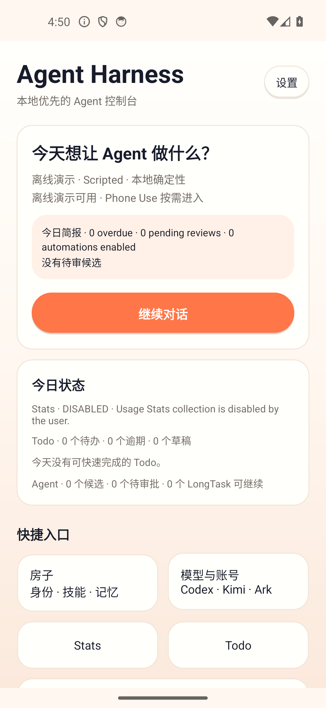
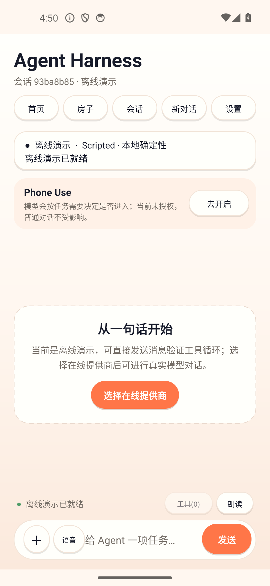
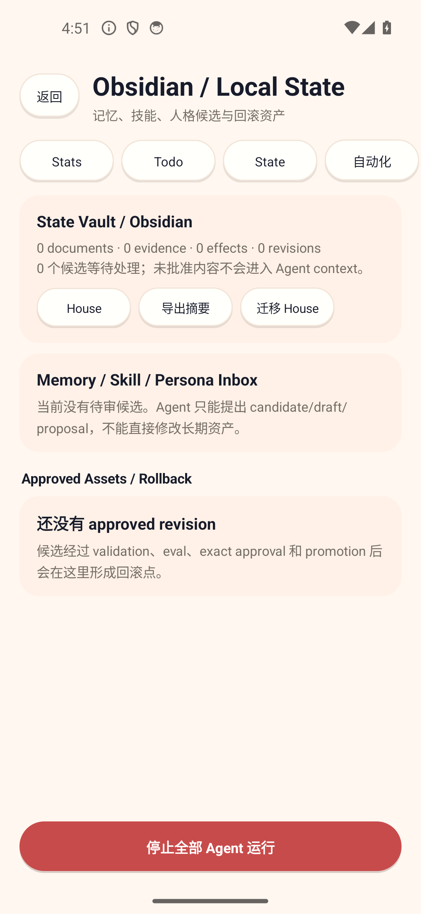
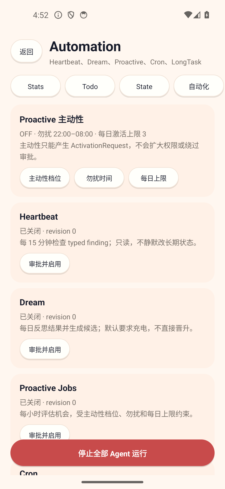
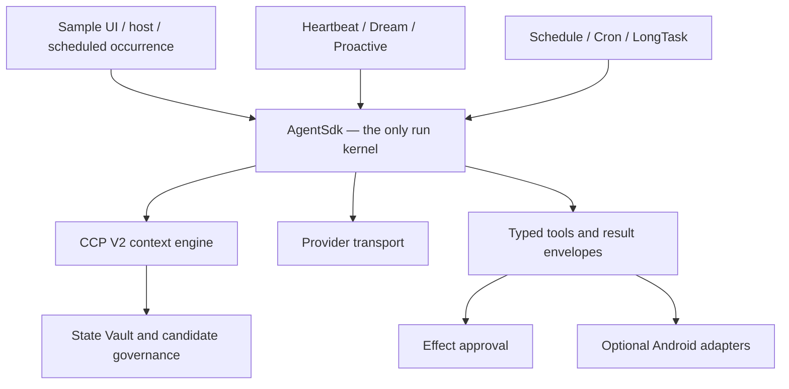

# Android Agent Harness

[](https://github.com/susyimes/android-agent-harness/actions/workflows/ci.yml)
[](LICENSE)
[](https://github.com/susyimes/android-agent-harness/releases)

Android Agent Harness is a provider-neutral Kotlin SDK for building bounded agents on the JVM and Android. It provides one governed run kernel plus optional context, state, scheduling, feedback, approval, product-data, Phone Use, Web4Agent, multimodal, and voice components.

The repository also ships an installable sample app. It is a reference composition, not a second runtime: Chat, Heartbeat, Dream, Proactive, Cron, and LongTask all enter the same `AgentSdk` lifecycle.

## What is included

- A cancellable and transactional run lifecycle with deadlines, per-session isolation, late-result fences, stable events, traces, and deterministic replay checks.
- CCP V2 context compilation with `ContextNeedSpec`, named-source availability checks, source trust/privacy/risk, conflict resolution, deterministic audited compression, token and item budgets, `EvidencePack`, `RouteGate`, and prompt rendering.
- A State Vault for memory, skill, and persona candidates with validation, evaluation, exact approval, promotion, revision history, and rollback.
- Provider-neutral remote AgentBrief generation with a deterministic local baseline, an isolated provider connection, bounded input/output, and timeout/late-result discard.
- A general effect-approval protocol bound to target, argument hash, risk, evidence, and expiry.
- Typed tool result envelopes with bounded content, structured data, effect/evidence references, and expiring raw-payload references.
- Reliable schedules, occurrences, leases, checkpoints, explicit `SKIP`/`RUN_ONCE`/`NEXT_WINDOW` missed-run behavior, Cron, and LongTask semantics.
- Heartbeat, Dream, Proactive, Home Brief, and Self Check with conservative local fallbacks and user-controlled initiative.
- Android adapters for permissions, Stats, Todo, local documents, State/House, location, calendar, notifications, scheduling, accessibility Phone Use, visual observation, sensors, STT, and TTS.
- A visible, session-keyed Web4Agent workbench with bounded DOM observation, structured reads, CSS/XPath inspection, exact-approved JavaScript/actions, console capture, and short-lived screenshots.
- True streaming for the OpenAI-compatible transport, serialized late-event fencing, file/image attachments, a global Stop control, and a strict Phone Use state machine.

## Sample app

<p align="center">
  <a href="docs/screenshots/android-home.png"></a>
  <a href="docs/screenshots/android-chat.png"></a>
  <a href="docs/screenshots/android-state.png"></a>
  <a href="docs/screenshots/android-automation.png"></a>
</p>

The v0.5.1 sample exposes:

- Home Brief, provider state, active runs, recent sessions, and shortcuts to every product surface.
- Chat with provider/model selection, streamed text, file/image attachment, speech input, TTS, Stop, and model-selected Phone Use.
- Model-selected Web4Agent tools plus a visible browser workbench shared with the user.
- Agent House editing plus skills and memory review.
- Stats and Todo with typed unavailable states and governed durable changes.
- State / Obsidian view for memory, skill, and persona candidates, evidence, effects, evaluations, promotion, rollback, and remote AgentBrief provenance.
- Automation controls for Heartbeat, Dream, Proactive, Cron, and LongTask, including revision, next run, receipts, checkpoints, pause, durable Stop, delete, and manual run.
- Permission disclosures and direct navigation to the relevant Android settings.
- A persisted approval setting with No approval, Risk-based, and Strict modes.
- Debug / Replay with stable events, approvals, occurrence receipts, self-check, deterministic trace evaluation, and redacted export.
- Data & Retention controls for domain-scoped export, retention, exact-approved deletion, and credential-boundary disclosure.

All background features default to off. Proactive work also obeys initiative level, quiet hours, and a daily activation cap.
The sample approval mode defaults to **No approval**: tool and Phone Use effects execute without an app-level approval prompt, while Android platform permissions still apply. Settings can switch to Risk-based approval or Strict approval at any time. This is a sample product policy; the SDK continues to leave approval policy to the host.

## Architecture



The core never grants capabilities from prompt text. The host owns credentials, tool registration, approval UI, Android permission declarations, persistence choices, retention policy, and background enablement.

## Quickstart

The deterministic JVM demo needs JDK 17 and does not need Android, a credential, a device, or network access:

```sh
git clone https://github.com/susyimes/android-agent-harness.git
cd android-agent-harness
./gradlew :demo:run
```

On Windows:

```powershell
.\gradlew.bat :demo:run
```

Build and install the Android sample:

```sh
./gradlew :sample:installDebug
```

Requirements:

- JDK 17;
- Android SDK Platform 36 for Android modules;
- Android 10 / API 29 or newer for all Android AARs and the sample.

## SDK artifacts

The v0.5.1 coordinates use group `dev.androidagent.harness`.

| Artifact | Type | Responsibility |
| --- | --- | --- |
| `harness-core` | JAR | Provider, tool, session, envelope, budget, and synchronous run contracts |
| `agent-sdk` | JAR | Lifecycle, events, cancellation, transactions, traces, replay, and House |
| `agent-approval` | JAR | Effect intent, policy, exact approval token, and journal |
| `context-engine` | JAR | CCP V2 selection, routing, evidence, and renderer |
| `agent-state` | JAR | State Vault, AgentBrief, candidates, evaluation, promotion, retention, and rollback |
| `agent-scheduling` | JAR | Schedule, occurrence, lease, checkpoint, Cron, and LongTask |
| `agent-feedback` | JAR | Signal/outcome journals, Heartbeat, Dream, Proactive, Home Brief, Self Check |
| `provider-openai` | JAR | OpenAI-compatible streaming and experimental Codex transports |
| `harness-eval` | JAR | Baseline/candidate evaluation |
| `device-loop` | JAR | Strict host-neutral observe → one action → observe/finish protocol |
| `agent-sdk-android` | AAR | Android Phone Use composition |
| `agent-permission-android` | AAR | Runtime/special permission and capability states |
| `agent-data-android` | AAR | Stats, Todo, State/House, document, location, calendar, notification adapters |
| `agent-scheduling-android` | AAR | WorkManager worker/backend, boot receiver, durable stores, visible LongTask carrier |
| `agent-voice-android` | AAR | STT, ephemeral recording, TTS, and transcript contracts |
| `device-loop-android` | AAR | Accessibility, approval overlay, visual and experimental sensor adapters |
| `web4agent-android` | AAR | Visible WebView sessions, DOM/JS tools, console, capture, and exact-approved web actions |

Publish all artifacts to the repository-local Maven directory:

```sh
./gradlew publishSdk
```

Consume only the modules your host needs:

```groovy
repositories {
    maven { url = uri("../android-agent-harness/build/sdk-repository") }
    google()
    mavenCentral()
}

dependencies {
    implementation "dev.androidagent.harness:agent-sdk:0.5.1"
    implementation "dev.androidagent.harness:context-engine:0.5.1"
    implementation "dev.androidagent.harness:agent-state:0.5.1"
    implementation "dev.androidagent.harness:provider-openai:0.5.1"

    // Optional Android features:
    implementation "dev.androidagent.harness:agent-sdk-android:0.5.1"
    implementation "dev.androidagent.harness:agent-data-android:0.5.1"
    implementation "dev.androidagent.harness:web4agent-android:0.5.1"
}
```

Run one turn:

```kotlin
val sdk = AgentSdk(sessionStore)
val handle = sdk.run(
    AgentRunRequest(
        sessionId = "chat-1",
        userInput = "Summarize the current task",
        providerFactory = providerFactory,
        contextSources = contextSources,
        tools = tools,
        traceSink = traceSink,
        listener = AgentRunListener { event -> render(event) }
    )
)

when (val outcome = handle.await()) {
    is AgentRunOutcome.Success -> showAnswer(outcome.result.output)
    is AgentRunOutcome.Failure -> showError(outcome.error)
    is AgentRunOutcome.Cancelled -> showStopped(outcome.reason)
    is AgentRunOutcome.Expired -> showExpired(outcome.reason)
}
```

Bind Stop to the same handle:

```kotlin
stopButton.setOnClickListener {
    handle.cancel("Stopped by user.")
}
```

Cancellation marks the run terminal, invokes the provider cancel hook, interrupts the worker, prevents another SDK-controlled effect, rejects late deltas/results, and discards the staged conversation turn. Effects already completed outside the session transaction cannot be rolled back automatically.

See [SDK Quickstart](docs/SDK_QUICKSTART.md) and [Architecture](docs/SDK_ARCHITECTURE.md) for integration details.

## Providers

The sample includes:

| Provider | Authentication | Model selection |
| --- | --- | --- |
| Offline demo | None | Deterministic scripted provider |
| Codex (experimental) | Browser PKCE with device-code fallback | Responses-compatible model |
| Kimi Plan | Coding Plan API key | Presets plus custom compatible id |
| Ark Plan | Plan API key | Full sample preset catalog plus custom compatible id |
| Custom compatible | API key | Host-supplied model id |

The model picker marks Ark models that currently reject image input as
`仅文本`; the sample blocks incompatible image attachments before starting a run.

Provider credentials are stored separately with Android Keystore-backed encryption. They never enter House, State Vault, trace exports, or prompts.

The experimental Codex login is a sample integration and is not presented as an officially supported third-party Android authentication surface.

## Phone Use protocol

Phone Use is not a fixed chat mode and is not activated by keywords. The selected model sees the tool schemas and chooses whether to call them.

1. A normal turn starts with an 8-provider-step budget.
2. A direct answer remains a normal chat turn.
3. The first real device tool call activates Phone Use for that turn.
4. The runtime expands the ceiling to 80 provider steps and permits one selected tool call per step.
5. `device_observe` returns a snapshot binding.
6. Exactly one action may use that binding; then observation is mandatory again.
7. `device_finish` requires fresh, visible completion evidence.

The run is also bounded by wall-clock time, tool count, repeated failures, approval expiry, and user Stop.

Approval is host-policy driven. In the sample, No approval is the default; Risk-based mode requires a human-backed surface for high-risk actions, and Strict mode requires it for every Phone Use action. Whenever policy requires approval, missing UI, denial, timeout, stale snapshot, changed target/arguments, or a mismatched token fails closed. Pressing Home is refused because it breaks the observed task chain.

Visual observation is optional, host-enabled, redacted, and represented by an expiring raw-payload reference. It is not a silent screenshot fallback.

## Web4Agent protocol

Web4Agent is a real WebView capability, not Accessibility automation over an
external browser. The sample registers these model-visible tools:

```text
web4agent_open / observe / read / inspect / eval
web4agent_act / console / capture / finish
```

Each chat receives a controller and visible WebView keyed by its Agent session
id. Standard Android WebView cookies and site storage still use the host app's
WebView profile and can persist across those controllers. `observe` assigns
reusable DOM element ids plus a host-owned `pageEpoch`, `observationId`,
`documentFingerprint`, and per-element `targetFingerprint`; `read` supports
text/HTML/links/forms/tables/meta;
`inspect` supports CSS selectors, XPath, and text queries; `eval` runs a
JavaScript function body; and `act` supports click, type, scroll, browser
navigation, reload, and bounded waits. Calling a Web4Agent tool activates the
same bounded one-tool-per-step expansion used for a long Phone Use turn.

The secure default enables JavaScript and DOM storage but permits only HTTPS
navigation and inline HTML. It disables cleartext HTTP, mixed content, local
file/content access, third-party cookies, popups, and autoplay. Page content is
untrusted external evidence. Web actions and free-form JavaScript bind the
observation epoch and fingerprints into the host's exact approval intent, then
atomically revalidate them on the WebView main thread immediately before the
effect. Drift returns `STALE_TARGET` with `occurred=false`. JavaScript alert,
confirm, prompt, and beforeunload callbacks are rejected in-process and never
open an ungoverned native modal. The sample's persisted approval mode applies
to web effects.

`web4agent_capture` writes PNG bytes only to a host-provided, TTL-scoped raw
payload store. Provider-visible text receives metadata and an opaque reference,
not image bytes.

## State and background safety

- Memory, skill, and persona output enters a pending candidate inbox first.
- A durable promotion requires validation, evaluation, an exact candidate hash, explicit approval, and an auditable revision.
- Rollback creates another governed revision; history is not silently rewritten.
- Dream can create a pending reflection candidate but cannot promote it.
- Workers dispatch typed occurrences into `AgentSdk`; they do not contain another model/tool loop.
- Schedule revisions, unique occurrence ids, leases, execution windows, checkpoints, and cancellation fences prevent stale or duplicate work.
- Boot/package-update restoration only re-enqueues schedules that remain enabled, applies the configured missed-run policy, and repairs a recurring chain after a completed occurrence is replayed.
- Each LongTask burst receives its declared `AgentRunBudget`; evidence and occurred-effect references are carried into the durable checkpoint.
- Visible LongTask work uses an optional foreground service with a notification Stop action. Stop persists a disabled schedule revision, cancels WorkManager work, and fences late completion.
- Proactive signal/outcome journals use bounded app-private atomic files, so cooldown and daily-cap evidence survives normal Android process death.

## Verification

Run the SDK gate:

```sh
./gradlew checkSdk
```

It covers unit tests, committed JVM ABI baselines, independent Maven JAR/AAR consumers, Android library lint, publication, and provenance checks.

Run the complete repository gate:

```sh
./gradlew checkM0
```

Run the sample instrumentation suite on a connected device:

```sh
./gradlew checkConnectedSample
```

The sample instrumentation suite checks navigation to every documented product
surface, guards the quick-entry buttons against clipped elevation shadows, and
runs all nine registered Web4Agent tools through `AgentToolRegistry` over one
inline visible-browser loop, including password-field redaction, page-lease
revalidation, JavaScript-dialog suppression, and exact-scope capture retrieval.

## Storage and privacy

- Provider secrets use Android Keystore-backed encryption in the sample.
- Sessions, House, State, Todo, schedules, leases, checkpoints, and feedback journals use app-private file adapters; these adapters are not encrypted databases.
- Raw image/audio payloads are optional, bounded, and temporary.
- Web page text and DOM results are provider-visible tool evidence only when the
  selected model calls a Web4Agent read tool. Web captures remain host-scoped
  TTL payloads.
- Android backup is disabled for the sample.
- Data & Retention exposes per-domain export, bounded retention, and explicit deletion.
- The SDK AARs do not force unrelated sensitive permissions into a host manifest.

A production host should replace file adapters when it needs database encryption, cross-process transactions beyond the supplied leases, managed backup, full-text search, or organization policy.

## Deliberate limits

- No GitHub, shell, repository mutation, or native arbitrary-code execution
  tools are registered. Web4Agent JavaScript is confined to its current
  WebView page and remains approval-gated.
- “Obsidian” means the local logical State/House view; this release does not read or write an external Obsidian vault format.
- Visual capture and local-understanding engines remain host-supplied and opt-in.
- There is no bundled offline foundation model.
- Artifacts are published to a repository-local Maven directory, not Maven Central.
- Release APK signing remains a release-owner responsibility; debug APKs are for development and sideloading.

## Known open review items

The following security/approval items are intentionally not addressed by the current implementation pass:

- Direct Provider composition still recognizes the textual `<policy-context` marker; hosts must not allow untrusted callers to construct policy-tagged `AgentContextItem` values.
- Schedule approval hashing does not yet include every behavior-affecting `ScheduleSpec` field.
- `AndroidPhoneAgent.request()` callers must currently supply the generic `AgentApprovalCoordinator` on the returned request, as the sample does; the legacy configuration gate is not bridged automatically.

The detailed target, responsibility boundaries, and acceptance evidence are in [Mirror Android Core Alignment Plan](docs/MIRROR_ANDROID_CORE_ALIGNMENT_PLAN.md). See [Release notes](docs/releases/v0.5.1.md), [Extraction and Compatibility](docs/EXTRACTION_AND_COMPATIBILITY.md), and [Provenance and Privacy](docs/PROVENANCE_PRIVACY.md) for additional boundaries.

## License

Apache License 2.0. See [LICENSE](LICENSE) and [THIRD_PARTY_NOTICES.md](THIRD_PARTY_NOTICES.md).
