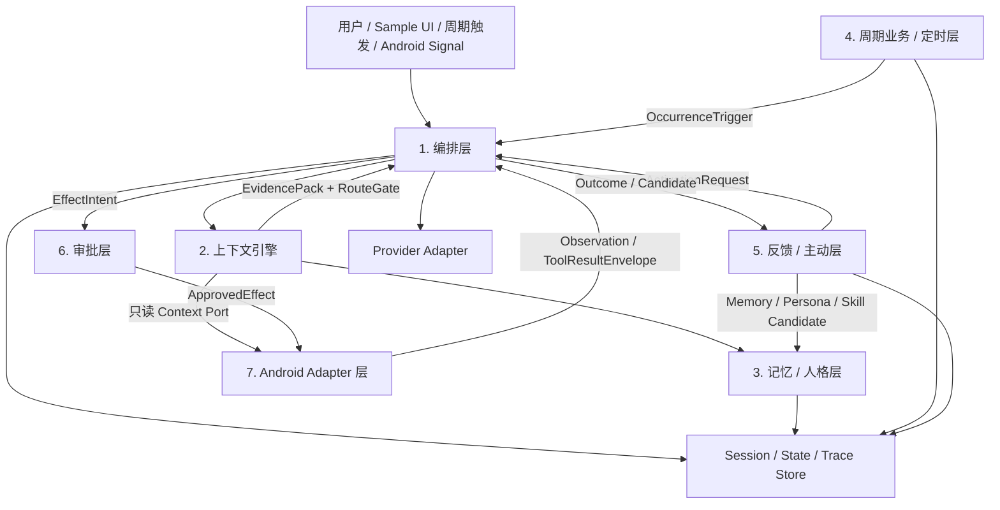
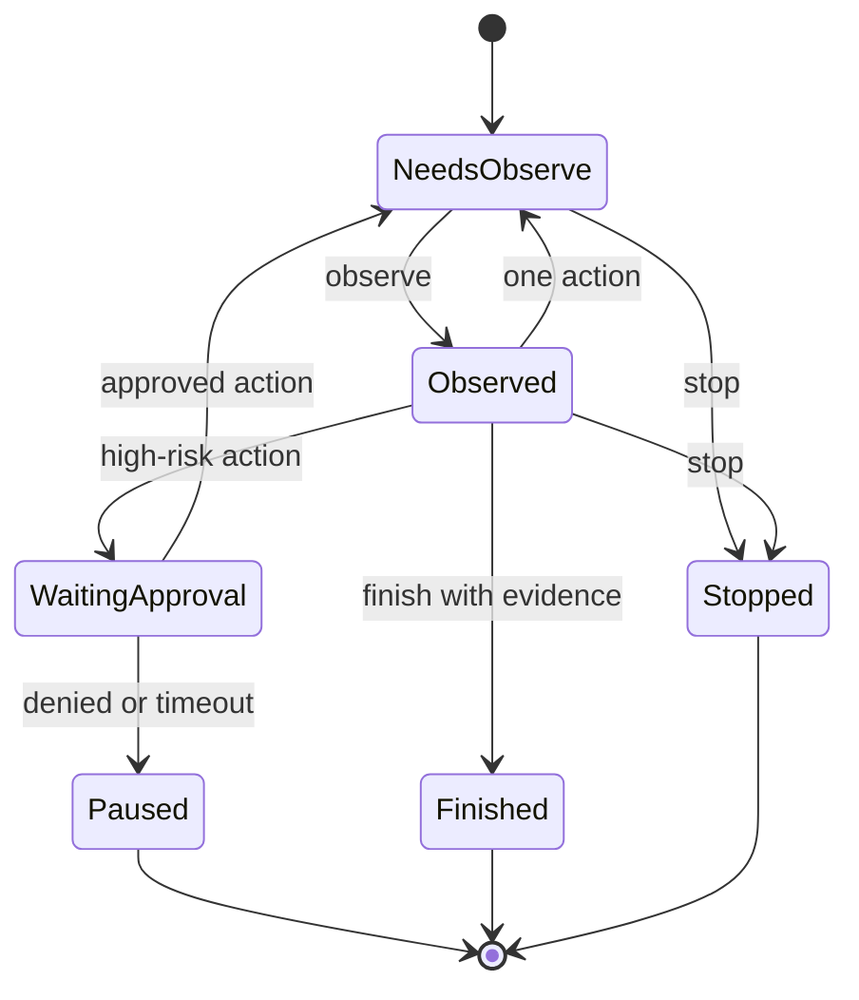

# mirror-android 核心能力补齐设计

- 状态：设计草案
- 快照日期：2026-07-28
- 目标仓库：Android Agent Harness
- 参考范围：mirror-android 当前 Android Agent 产品能力

## 1. 文档目的

本文定义 Android Agent Harness 在不引入 GitHub/代码执行层和 Web 层的前提下，补齐 mirror-android 核心产品能力的完整方案。

这不是源码、包名、资源、Prompt、存储格式或视觉资产兼容计划。参考仓库只作为只读的功能与责任边界证据；目标实现继续使用独立设计、独立 API、独立数据格式和独立 UI 资源。

本文先解决五个问题：

1. 哪些能力已经具备，哪些只是局部具备，哪些完全缺失。
2. 哪些能力应进入稳定 SDK，哪些只能放在可选 Android 组件或 sample 产品层。
3. 编排、上下文、记忆/人格、周期业务/定时、反馈/主动、审批和 Android Adapter 七层如何分工。
4. Agent 的上下文、记忆、技能、人格、主动任务和设备操作如何形成一个可审计闭环。
5. 后续按什么顺序实现，以及每个阶段如何验收。

本文本身不启用后台自治、不修改现有运行行为，也不承诺对参考产品数据的直接导入兼容。

## 2. 范围

### 2.1 本轮纳入

- Run lifecycle、结构化事件、停止、取消、超时、并发隔离和事务式 session。
- Provider、Tool、Approval、ContextSource、SessionStore、TraceSink 等稳定接口。
- 流式输出、图片附件和 Provider capability 描述。
- Context Control Plane：
  - `ContextNeedSpec`
  - 候选召回与筛选
  - trust/risk/provenance
  - 预算
  - 冲突处理
  - `EvidencePack`
  - `RouteGate`
  - `PromptBundle`
  - renderer
- 通用工具结果 envelope、原始结果临时引用、效果分类和审批闭环。
- Agent House、技能草案、记忆候选、人格提议、Psyche 观察和受治理的资产演化。
- 本地持续状态层（本文称为 `Agent State Vault`，产品 UI 可使用“Obsidian/本地状态”文案）。
- MirrorStats、Todo、Permission、House、本地状态、会话、通知、文件、位置、日历等产品数据源适配。
- Heartbeat、Dream、Proactive、Cron、LongTask、Home Brief 和 Self Check。
- model-selected Phone Use、严格的 `observe -> one action -> observe/finish` 协议、视觉回退和用户审批。
- Android 后台调度、Worker、Receiver、前台运行承载和通知。
- 语音输入、语音输出、转写会话和可选本地理解引擎。
- Home、Chat、House、Memory Inbox、自动化、权限、调试等 sample 页面。
- 测试、回放、评估、隐私、迁移和发布门禁。

### 2.2 本轮明确排除

- GitHub 仓库发现、Issue/PR、分支、合并、CI 和远端仓库操作。
- Source patch、仓库 worker、端上代码修改、编译、签名、安装、发布。
- Termux/Codex coding runtime、代码窗口、ADB shell 或通用命令执行。
- Web4Agent、网页浏览器、DOM/JavaScript 工具、MiniApp 和 WebView bridge。
- 动态加载 Dex/JAR/so、Kotlin Script、Wasm 或通用插件运行时。
- 参考产品的品牌、布局、图标、Prompt、默认人格文本、数据目录或序列化格式复制。

排除项不会显示为“即将可用”的假入口，也不会把空实现注册成模型工具。只在稳定的 Provider、Tool、ContextSource 和 CapabilityModule 接口处保留未来扩展点。

## 3. 对齐定义

本方案中的“对齐”分三层：

| 层级 | 对齐内容 | 不要求 |
| --- | --- | --- |
| 核心语义 | 能力边界、状态机、风险控制、上下文和写回闭环 | 类名、包名、实现代码相同 |
| 产品流程 | 用户能找到、理解、开启、停止、审查和纠错对应能力 | 页面像素级复刻 |
| 可验证行为 | 相同场景满足相同安全与完成条件 | 存储文件或网络请求兼容 |

SDK 不负责替宿主 App 做产品决定。最终权限声明、凭据、数据保留、后台开关、通知策略、审批 UI 和高风险定义仍由宿主拥有。

## 4. 实施状态与差距

本章前四节保留 v0.3.0 立项时的基线，便于审计“为什么要做 M9–M16”；4.5 是 v0.4.0 当前实现状态。后续阅读和验收应以 4.5 与第 20 节为准。

### 4.1 立项时已可作为基础保留（v0.3.0）

| 能力 | 当前状态 | 结论 |
| --- | --- | --- |
| 异步 Run API | 已有 `AgentSdk.run`、handle、await | 保留并扩展，不重写 |
| 停止与取消 | 已有 provider cancel、线程中断、late-result fence | 保留，补 deadline 与后台任务联动 |
| 并发隔离 | 已有全局 worker 上限和单 session 单活跃 run | 保留，补跨进程 lease |
| 事务式 session | 成功提交；失败、超限和取消丢弃 staged turn | 保留，补 revision 和迁移 |
| Provider 工厂 | 每个 run 建立隔离连接 | 保留 |
| OpenAI-compatible Provider | 已支持 Codex 实验适配、Kimi Plan、Ark Plan 和自定义端点 | 保留，补 capability/stream/image |
| 工具 schema | 已支持常用 JSON Schema 类型 | 保留 |
| Tool profile | 已有显式 allowlist | 保留，升级为 capability/effect policy |
| 基础 Trace | 已有 Context、Provider、Tool、完成和 Phone Use 激活事件 | 保留，升级为稳定 `TraceSink` |
| Agent House | 已有 8 个通用 core 文档、技能和 daily memory | 扩展，不做格式兼容 |
| Phone Use 激活 | 模型真实调用设备工具后才进入，非关键词模式 | 作为唯一默认模式 |
| Phone Use 预算 | 普通 8 步，激活后最多 80 步且每轮一个工具 | 保留为默认值，改为多维预算 |
| 人工审批 | Android host 已有真实人工审批 gate | 抽象成通用审批协议 |
| Android Keystore 凭据 | sample 已隔离保存各 Provider 凭据 | 保留在产品层 |
| Markdown 资产评估 | 已有 baseline/candidate harness | 接入 House/人格/技能晋升闭环 |

### 4.2 立项时局部具备但需要升级（v0.3.0）

| 能力 | 当前限制 | 目标 |
| --- | --- | --- |
| Context | 只按 trust、priority、字符数选择 | 完整 CCP V2 |
| Tool result | 只有 `content + isError` | 结构化 envelope、evidence、effect、raw ref |
| Approval | 仅设备动作有专用 gate | 所有有副作用工具共用通用协议 |
| Session transaction | 只覆盖消息提交 | 增加 effect journal、revision、checkpoint |
| House memory | Agent 可直接追加 daily memory | durable memory 默认只生成 pending candidate |
| House skill | Agent 可写 disabled draft | 增加 diff、证据、评估、审批、版本和回滚 |
| Device loop | 单工具调用已具备，但没有独立协议状态机 | 强制 snapshot 绑定和 observe/act/finish 转移 |
| Accessibility | 语义树、点击、输入等已具备 | 事件稳定、恢复策略、视觉回退、更多动作 |
| Home | 只有 provider、House、会话和权限摘要 | 接入 stats、todo、Home Brief、自动化状态 |
| Debug | Trace 主要随 run 暂存 | 可持久化、脱敏、导出和 replay |

### 4.3 立项时尚未实现（v0.3.0）

- `ContextNeedSpec`、候选池、统一 reranker、conflict resolver、`EvidencePack`、`RouteGate`、`PromptBundleRenderer`。
- 通用 `TraceSink`、`ApprovalGate`、`RawPayloadStore`、`MemoryCandidateSink`。
- Agent State Vault、事件日志、evidence index、pending effects、Agent Brief 预览。
- Heartbeat、Dream、Proactive、Cron、LongTask、Home Brief、Self Check。
- Stats、Todo、Permission 等产品数据源和页面。
- 人格提议、Psyche 观察、Memory Inbox、受治理的资产晋升/回滚。
- 流式回答、图片附件、视觉观察、语音模块。
- 可插拔本地理解引擎。
- Android 后台 WorkManager/Worker/Receiver/前台承载模块。
- 二进制 API 兼容门禁、Android 进程死亡/重启恢复测试和完整端到端回放。

### 4.4 立项基线与完整差距矩阵

下表是本方案的基线清单。`已有` 表示当前主链路中已经存在且可保留；`局部` 表示存在实现但尚未达到稳定层契约；`缺失` 表示需要新建。

| 分层/能力 | 当前能力 | 状态 | 完整差距 | 目标章节 |
| --- | --- | --- | --- | --- |
| 编排：run lifecycle | `AgentSdk.run`、handle、await、cancel、late-result fence | 已有 | deadline、统一状态、checkpoint、跨进程 lease、effect/candidate 独立事务 | 7 |
| 编排：事件与 trace | 基础 run/trace 事件 | 局部 | 稳定 `AgentEvent`、`TraceSink`、脱敏、持久化、replay | 7 |
| 编排：Provider/Tool | 隔离 Provider、tool schema、profile allowlist | 局部 | capability、stream/image、错误分类、多维预算、稳定 Tool Envelope | 7 |
| 上下文引擎：CCP V2 | trust、priority、字符预算选择 | 局部 | NeedSpec、候选池、privacy/risk、冲突、EvidencePack、RouteGate、renderer | 8 |
| 记忆/人格：House | 8 个 core 文档、skill draft、daily memory | 局部 | State Vault、逻辑资产版本、evidence、候选 inbox、统一晋升与回滚 | 9 |
| 记忆/人格：Memory | Agent 可追加 daily memory | 局部且需收紧 | 只产出 pending candidate；去重、冲突、评估、审批、过期、回滚 | 9 |
| 记忆/人格：Skill | 可写 disabled draft | 局部 | diff、harness eval、审批、版本、启用与回滚 | 9 |
| 记忆/人格：Persona | 无稳定提议接口 | 缺失 | Psyche 观察、Persona Proposal、实验 revision、审批与回滚 | 9 |
| 周期业务/定时 | 可复用 run/cancel primitive | 局部 | ScheduleSpec、occurrence、lease、missed-run、checkpoint、Cron、LongTask | 10 |
| 反馈/主动：Heartbeat | 无 | 缺失 | 低成本观察、typed skip、finding/candidate、通知 gate | 11 |
| 反馈/主动：Dream | 无 | 缺失 | collect/reflect/propose、候选证据和纠错入口 | 11 |
| 反馈/主动：Proactive | 无 | 缺失 | signal journal、机会评分、主动性策略、outcome feedback | 11 |
| 反馈/主动：Home Brief/Self Check | 无 | 缺失 | 本地聚合、健康诊断、用户可见结果 | 11 |
| 审批：设备动作 | Android host 有人工 gate | 局部 | 统一 effect plan、hash/expiry、approval token、结果 journal | 12 |
| 审批：其他副作用 | 主要依赖工具专用逻辑 | 缺失 | Todo/文件/通知/schedule/长期资产晋升统一 fail-closed | 12 |
| Android Adapter：Permission | sample 有部分权限状态 | 局部 | 统一 `PermissionSnapshot`、设置导航、feature capability binding | 13 |
| Android Adapter：Stats/Todo | 无 | 缺失 | UsageStats 聚合、本地 Todo draft/commit、typed unavailable | 13 |
| Android Adapter：House/Obsidian | House 文件存在 | 局部 | 独立 Android store adapter、State Vault/Obsidian 产品视图、迁移与 retention | 13 |
| Android Adapter：其他数据源 | 会话和少量工具状态 | 局部 | 文件、通知、位置、日历、传感器等窄授权 adapters | 13 |
| Android Adapter：后台承载 | 无 | 缺失 | WorkManager、Alarm、前台运行、Receiver、Stop、重试和恢复 | 13 |
| Android Adapter：Phone Use | 模型按需激活、基本 Accessibility 动作 | 局部 | 显式协议状态机、snapshot 绑定、视觉回退、finish evidence、恢复 | 13 |
| Streaming/多模态/语音 | Provider 以非流式文本为主 | 缺失 | delta、附件、本轮授权媒体、STT/TTS、取消和临时存储 | 7、13 |
| sample 产品 | Chat、模型、House、权限摘要 | 局部 | Home/Obsidian/Automation/Approval/Debug 完整页面和用户控制 | 15 |

矩阵中的每一项都必须在里程碑和总验收清单中有对应项；不能以占位实现、隐藏开关或仅有 UI 的方式标记完成。

### 4.5 v0.4.0 当前实现矩阵

`完成` 表示能力已进入公开接口和真实主链路并有自动化测试；`宿主可选` 表示 SDK 已提供窄接口/adapter，但宿主必须主动声明权限、组件或实现数据 surface。不存在以空页面或固定假数据标记完成的项目。

| 分层/能力 | v0.4.0 状态 | 实现与证据 | 剩余边界 |
| --- | --- | --- | --- |
| 编排：run lifecycle | 完成 | `AgentSdk` 统一 USER/HEARTBEAT/DREAM/PROACTIVE/CRON/LONG_TASK；state、deadline、cancel、session fence、CAS transaction、late-result fence | 外部 effect 不能由 session transaction 自动回滚 |
| 编排：事件与 trace | 完成 | 稳定 `AgentEvent`/`TraceSink`、审批等待状态、stream delta、脱敏组合 sink、确定性 replay | sample trace 是有界进程日志；生产持久化由宿主实现 |
| 编排：Provider/Tool | 完成 | run-scoped Provider、capability、8/80 步、工具/时间/重复失败/input/output token 预算、Tool Envelope | 自定义 Provider 不上报 usage 时使用保守字符估算 |
| 上下文引擎：CCP V2 | 完成 | `ContextNeedSpec`、候选池、trust/privacy/risk/freshness、冲突、预算、`EvidencePack`、真实 `RouteGate` 终止/继续、renderer | 无内置向量数据库；可由 `ContextSource` 替换 |
| 记忆/人格：House/State | 完成 | House 兼容层、State Vault、events/evidence/effects/brief/psyche、Android file adapter、迁移、retention | “Obsidian”是逻辑产品视图，不兼容外部 vault 格式 |
| 记忆/人格：Memory | 完成 | Agent 默认只调用 `agent_memory_propose`；pending candidate、dedupe/conflict/eval/approval/promotion/rollback | 旧 direct append 仅在显式兼容 flag 下注册 |
| 记忆/人格：Skill | 完成 | Agent 写 disabled House draft并同步 Skill Inbox；eval、审批、revision、启用和回滚 | 不执行任意 skill 脚本 |
| 记忆/人格：Persona | 完成 | `agent_persona_propose`、Psyche、Persona Inbox、hash/eval/approval/promotion/rollback | Agent 提议不能直接改变主动性或权限 |
| 周期业务/定时 | 完成 | ScheduleSpec、occurrence、revision、lease、missed-run、Cron、LongTask coordinator/checkpoint | exact alarm backend 未绑定；当前可靠调度采用 WorkManager |
| 反馈/主动：Heartbeat | 完成 | typed Todo/permission/candidate/failure findings、signal、共用 `AgentSdk` | 通知是否展示由宿主产品策略决定 |
| 反馈/主动：Dream | 完成 | outcome/candidate reflection、共用 `AgentSdk`、仅产出 pending reflection candidate、过滤无建议输出 | 不静默晋升 durable asset |
| 反馈/主动：Proactive | 完成 | opportunity score、用户主动性档位、quiet hours、cooldown、单次/每日 cap、ActivationRequest | 默认 OFF |
| Home Brief / Self Check | 完成 | 无 Provider 时本地聚合；Home 与 Debug 显示真实结果 | 不作为审批或权限来源 |
| 审批：通用协议 | 完成 | target/argument hash/risk/evidence/expiry、one-use token、observer/journal、无 UI fail-closed | 状态 CAS 由具体 Todo/State/Schedule/House adapter 再校验 |
| Android：Permission | 完成 | runtime/special/service/manifest typed state、用途披露和设置导航 | AAR manifest 不自动扩权 |
| Android：Stats/Todo | 完成 | UsageStats 聚合与真实零数据区分；Todo draft/commit/revision/effect/归档/删除 | Stats 默认关闭，raw timeline 不进 Prompt |
| Android：House/Obsidian | 完成 | app-private House/State store、迁移、候选审查、导出/retention/delete/reset | 默认文件 store 不是加密数据库 |
| Android：其他数据源 | 宿主可选 | SAF document、coarse location、calendar、host-fed notification、experimental sensor typed adapters | 宿主选择后才授权；没有假授权或全量读取 |
| Android：后台承载 | 完成 | WorkManager unique occurrence、boot/package receiver、持久 lease/checkpoint、visible LongTask foreground service 与 Stop | sample 不使用 AlarmManager |
| Android：Phone Use | 完成 | 模型真实工具调用激活、strict snapshot state machine、Accessibility、稳定等待、finish evidence、overlay approval、optional visual | 无障碍和 visual 必须由用户/宿主开启 |
| Streaming/多模态/语音 | 完成 | compatible SSE、late-delta fence、AttachmentRef、临时 visual/raw payload、STT/录音/TTS | 无捆绑本地大模型或第三方流式 ASR |
| sample 产品 | 完成 | Home、Chat、House、Stats、Todo、State、Automation、Permissions、Debug、Data & Retention、approval、Stop | GitHub、Web、任意代码执行按范围明确排除 |

当前仍明确不做的交付包括：Maven Central、生产签名密钥、外部 Obsidian 格式兼容、内置离线基础模型、GitHub/Web/任意代码执行 adapter，以及替宿主决定生产数据库/加密/备份策略。

## 5. 七层目标架构



七层是运行时责任边界，不等于必须发布七个 artifact。先保证依赖方向和接口边界，再按 API 稳定度决定拆包。

| 层 | 只负责 | 明确不负责 |
| --- | --- | --- |
| 1. 编排层 | run lifecycle、预算、并发、Provider/tool loop、事件、事务、Envelope、取消 | 不直接读取 Android API；不自行批准副作用；不拼接各数据源私有格式 |
| 2. 上下文引擎 | NeedSpec、召回、trust/risk、预算、冲突、EvidencePack、RouteGate、PromptBundle | 不执行工具；不修改记忆；不把低信任文本升级成指令 |
| 3. 记忆/人格层 | State Vault、House、Obsidian 逻辑状态、候选、评估、版本、晋升、回滚 | 不直接调模型或 Android；不让 Agent 静默写 durable memory/persona/enabled skill |
| 4. 周期业务/定时层 | schedule、occurrence、lease、missed-run、checkpoint、Cron、LongTask 的可靠运行语义 | 不决定“为什么主动”；不直接使用 WorkManager/Alarm API；不另造 Agent loop |
| 5. 反馈/主动层 | Signal/Outcome journal、Heartbeat、Dream、Proactive、Home Brief、Self Check、ActivationRequest | 不直接产生外部副作用；不绕过编排、上下文或审批 |
| 6. 审批层 | effect 归类、风险、effect plan、用户/host 决策、approval token、审计 | 不执行 Android 动作；不接受模型自报批准；不替代 Context RouteGate |
| 7. Android Adapter 层 | Phone Use、Permission、Stats、Todo、House/Obsidian store、文件、通知、位置、日历、传感器、后台承载、媒体/语音 | 不持有 Agent 决策策略；不直接改长期记忆；不在 adapter 内隐藏多步 Agent 行为 |

### 5.1 单一受治理主链路

所有用户轮次和后台轮次都进入同一条受治理主链路：

```text
Trigger
  -> RunPolicy + RunBudget
  -> ContextNeedSpec
  -> Memory/Persona + Android ContextSource candidates
  -> EvidencePack + RouteGate
  -> PromptBundle
  -> Provider
  -> zero or one EffectIntent
  -> ApprovalGate when required
  -> Android Adapter
  -> ToolResultEnvelope / observe / validate
  -> final answer or checkpoint
  -> session commit
  -> OutcomeJournal
  -> pending memory/persona/skill candidates or next ActivationRequest
  -> trace
```

不再为 Chat、Heartbeat、Dream、Proactive 和 LongTask 分别实现互不兼容的模型循环。它们只提供不同的 trigger、tool profile、budget、route policy、write policy 和 output contract。

### 5.2 依赖和调用规则

1. 编排层是唯一能够推进 run 和 Provider/tool loop 的层。
2. 上下文引擎通过 port 读取记忆/人格和 Android 数据，返回编译结果，不持有副作用能力。
3. 周期业务/定时层只产生 `OccurrenceTrigger`；反馈/主动层只产生 `ActivationRequest` 或候选。
4. 任何 `LOCAL_DURABLE_WRITE`、`EXTERNAL_WRITE`、`DEVICE_ACTION` 和受治理资产晋升先形成 `EffectIntent`，再交给审批层。
5. Android Adapter 只接受已经过 capability、policy 和必要审批验证的调用，并返回结构化 observation/envelope。
6. 结果先回编排层完成事务与状态推进，再送反馈/主动层做 outcome 分析；adapter 不直接触发下一次模型调用。
7. 各层只依赖下一节定义的稳定 port，不依赖 sample Activity、具体 Worker 或具体数据库表。

### 5.3 RouteGate 与 ApprovalGate 不合并

两者都叫“gate”，但解决的问题不同：

| Gate | 输入 | 决定 | 例子 |
| --- | --- | --- | --- |
| `RouteGate` | NeedSpec、EvidencePack、capability/上下文状态 | 本轮本地回答、继续 Provider、询问用户或阻断 | 缺少目标 App 时先询问；证据不足时不继续 |
| `ApprovalGate` | 已确定的 EffectIntent、目标、参数 hash、风险、证据 | 是否允许一个具体副作用发生 | 是否真的发送消息、改 Todo、覆盖文件或点击支付 |

`RouteGate=CONTINUE_PROVIDER` 不代表任何 effect 已获批准；`ApprovalGate=APPROVED` 也只授权绑定 hash 的那一个 effect。

### 5.4 一个上下文编译器

House、State Vault 和历史会话都是 `ContextSource`，不再各自直接拼 Prompt。`AgentBrief` 是 `EvidencePack/PromptBundle` 的可持久化审查视图，而不是第二套 Prompt 组装系统。

### 5.5 三种交付层的职责划分

| 层 | 责任 |
| --- | --- |
| 纯 JVM SDK | 前六层的平台无关接口与状态机：编排、CCP V2、State Vault/候选治理、周期语义、反馈/主动策略、审批协议；以及可测试 runner 和 store ports |
| 可选 Android 组件 | 第七层的具体实现：Permission、UsageStats、Todo store、House/Obsidian store、Accessibility/Phone Use、WorkManager/Alarm/前台运行、通知、文件、位置、日历、媒体、语音和传感器 |
| sample 产品 | composition root、导航、设置、Provider 凭据、主动性开关、审批 UI、权限教育、数据披露、Stop、候选审查、调试和用户文案 |

SDK 不在核心 manifest 中索取敏感权限，不自动创建 schedule，也不决定 sample 的审批文案。sample 不直接推进内部状态机，也不绕开 SDK 调用 adapter。

### 5.6 需求内容到七层的归属

| 文档必须包含的能力 | 主归属层 | 协作层 |
| --- | --- | --- |
| 当前能力与完整差距矩阵 | 总体设计 | 所有层 |
| SDK / Android 可选组件 / sample 职责 | 总体设计 | 所有层 |
| CCP V2 | 上下文引擎 | 编排、记忆/人格、Android Adapter |
| Tool Envelope | 编排 | Android Adapter、审批 |
| 通用审批 | 审批 | 编排、sample UI、Android Adapter |
| State Vault | 记忆/人格 | 上下文引擎、存储 adapter |
| 记忆/技能/人格候选—评估—审批—回滚 | 记忆/人格 | 审批、反馈/主动、sample UI |
| Stats、Todo、Permission、House、Obsidian 数据源 | Android Adapter | 上下文引擎、记忆/人格、sample UI |
| Heartbeat、Dream、Proactive | 反馈/主动 | 周期业务/定时、编排 |
| Cron、LongTask | 周期业务/定时 | Android Adapter、编排 |
| 严格 Phone Use | Android Adapter | 编排、审批、上下文引擎 |
| Streaming | 编排/Provider transport | sample UI |
| 多模态与语音 | Android Adapter | 编排/Provider transport、sample UI |

## 6. 分层模块与 artifact 规划

| 分层 | 模块 | 类型 | 责任 |
| --- | --- | --- | --- |
| 编排 | `harness-core` | 现有 JVM | Provider/Tool/Session 基础契约、单轮有界执行、Envelope |
| 编排 | `agent-sdk` | 现有 JVM | Run lifecycle、事件、取消、并发、事务、统一 facade |
| 编排 | `provider-openai` | 现有 JVM | compatible/Codex transport、stream/image capability |
| 上下文引擎 | `context-engine` | 新 JVM | NeedSpec、候选、trust/risk、预算、EvidencePack、RouteGate、renderer |
| 记忆/人格 | `agent-state` | 新 JVM | House、State Vault、events/effects、candidate inbox、版本和回滚 |
| 周期业务/定时 | `agent-scheduling` | 新 JVM | schedule/occurrence、lease、Cron、LongTask、checkpoint、平台无关 runner |
| 反馈/主动 | `agent-feedback` | 新 JVM | Signal/Outcome journal、Heartbeat、Dream、Proactive、Home Brief、Self Check |
| 审批 | `agent-approval` | 新 JVM | EffectIntent、风险策略、ApprovalGate、token、journal 和测试 fixture |
| 跨层评估 | `harness-eval` | 现有 JVM | CCP、资产、周期、主动、审批和设备回放评估 |
| Android Adapter | `device-loop` | 现有 JVM | 严格设备协议状态机、snapshot binding、finish evidence |
| Android Adapter | `device-loop-android` | 现有 AAR | Accessibility 观察、动作、稳定等待、可选视觉、本地理解接口和 sensor |
| Android Adapter | `agent-sdk-android` | 现有 AAR | Android host 组合入口和 adapter registry |
| Android Adapter | `agent-scheduling-android` | 新 AAR | WorkManager、Worker、Receiver、前台任务、通知、Stop |
| Android Adapter | `agent-permission-android` | 新 AAR | PermissionSnapshot、特殊权限和 capability 状态 |
| Android Adapter | `agent-data-android` | 新 AAR | Stats/Todo/House/Obsidian/file/location/calendar/notification/sensor adapters |
| Android Adapter | `agent-voice-android` | 新 AAR | STT、PCM、streaming transcription、TTS、transcript store |
| sample 产品 | `sample` | 现有 App | 完整产品流程、用户控制和 composition root |

为降低一次性改造风险，`context-engine`、`agent-scheduling`、`agent-feedback` 和 `agent-approval` 可以先作为目标 package 落在现有 JVM artifact 中，达到稳定 API 后再单独发布；但依赖方向从第一天就必须遵守。Android 模块只有在宿主选择 feature 时才引入对应 manifest、权限和依赖。

## 7. 编排层：稳定 SDK 契约与单一运行内核

编排层负责把一次触发推进为有界、可取消、可审计、可提交的 run。它是唯一 Provider/tool loop；Chat、Heartbeat、Dream、Proactive、Cron 和 LongTask 都通过相同入口执行。

### 7.1 Run lifecycle

保留当前 `AgentRunHandle` 语义，并扩展以下模型：

```kotlin
data class RunPolicy(
    val trigger: RunTrigger,
    val budget: RunBudget,
    val toolProfileId: String,
    val contextPolicyId: String,
    val writePolicyId: String,
    val approvalPolicyId: String
)

data class RunBudget(
    val maxProviderSteps: Int,
    val maxToolCalls: Int,
    val maxWallClockMillis: Long,
    val maxRepeatedFailures: Int,
    val maxInputTokens: Int?,
    val maxOutputTokens: Int?
)
```

`RunTrigger` 至少区分：

- `USER`
- `HEARTBEAT`
- `DREAM`
- `PROACTIVE`
- `CRON`
- `LONG_TASK`
- `SELF_CHECK`

Run 状态统一为：

```text
created
queued
running
waiting_approval
checkpointed
completed
failed
cancelled
expired
```

状态只能由本地 runtime 推进。模型不能把 run、approval、candidate 或 effect 自报为已批准或已完成。

### 7.2 事件

新增统一 `AgentEvent`，至少覆盖：

- `RunStarted`
- `ContextNeedAnalyzed`
- `ContextCandidateSelected`
- `ContextCandidateDropped`
- `RouteDecided`
- `ProviderStarted`
- `ProviderDelta`
- `ProviderCompleted`
- `ToolRequested`
- `ApprovalRequested`
- `ApprovalResolved`
- `ToolCompleted`
- `DeviceLoopActivated`
- `CheckpointSaved`
- `CandidateProduced`
- `RunFinished`

当前 `AgentRunEvent` 和 `AgentHarnessTraceEvent` 通过 adapter 继续工作；新事件不能要求现有消费者立即迁移。

### 7.3 Provider

现有同步 `AgentProvider` 保持兼容，新增可选能力接口：

```kotlin
data class ProviderCapabilities(
    val streaming: Boolean,
    val toolCalls: Boolean,
    val imageInput: Boolean,
    val parallelToolCalls: Boolean,
    val structuredOutput: Boolean
)

interface StreamingAgentProvider : AgentProvider {
    fun stream(request: AgentProviderRequest, sink: ProviderEventSink)
}
```

规则：

- 每个 run 仍获得隔离连接。
- Provider 必须支持 cancel hook、deadline 和错误分类。
- Provider 不决定权限、审批、工具可用性或长期写回。
- 不支持某项 capability 时明确降级，不伪造流式、视觉或结构化输出。
- 凭据、端点和账号生命周期继续由 host 管理。

### 7.4 Tool

在现有 `AgentToolSpec` 上增加稳定能力描述：

```kotlin
data class ToolCapability(
    val sideEffect: ToolSideEffect,
    val risk: ToolRisk,
    val dataScopes: Set<String>,
    val requiresForeground: Boolean,
    val idempotency: ToolIdempotency,
    val supportsCancellation: Boolean
)
```

`ToolSideEffect`：

- `NONE`
- `LOCAL_READ`
- `LOCAL_DRAFT_WRITE`
- `LOCAL_DURABLE_WRITE`
- `EXTERNAL_WRITE`
- `DEVICE_ACTION`

工具注册时由 host 声明 capability；Prompt 或 House 文本不能扩大 capability。

### 7.5 EffectIntent 与审批调用点

编排层不内置审批策略。它把拟执行的副作用标准化后调用第 12 节的审批层：

```kotlin
data class EffectIntent(
    val runId: String,
    val toolCallId: String,
    val capabilityId: String,
    val sideEffect: ToolSideEffect,
    val targetRef: String?,
    val argumentHash: String,
    val summary: String,
    val evidenceRefs: List<String>
)
```

调用顺序固定为：

```text
tool call
  -> schema/capability validation
  -> EffectIntent
  -> ApprovalPolicy decision
  -> optional ApprovalRequest
  -> one-time ApprovalToken
  -> adapter execute
  -> ToolResultEnvelope + EffectRecord
```

无副作用的纯读也要经过 capability/privacy 检查，但不强制弹出用户审批。需要审批的 intent 在 token 不存在、过期、hash 不匹配、deny、timeout 或 UI 不可用时一律不调用 adapter。

### 7.6 ToolResultEnvelope

替换只有 `content + isError` 的结果模型：

```kotlin
data class ToolResultEnvelope(
    val status: ToolResultStatus,
    val summary: String,
    val dataJson: String?,
    val evidence: List<EvidenceRef>,
    val artifacts: List<ArtifactRef>,
    val rawPayloadRef: String?,
    val effect: ToolEffectRecord?,
    val retryAdvice: RetryAdvice?,
    val privacy: PrivacyLabel,
    val createdAtEpochMillis: Long,
    val expiresAtEpochMillis: Long?
)
```

约束：

- 发送给模型的是有界 summary 和必要结构化字段。
- 大结果交给 `RawPayloadStore`，只通过不透明 ref 展开。
- ref 有 TTL、大小上限、scope 和访问审计。
- 外部 App、网页、文件、通知和工具文本一律按不可信 evidence 渲染，不能成为新指令。
- 工具 effect 与 session transaction 分开记录；取消 session 不代表外部 effect 被撤销。
- 旧 `AgentToolResult` 通过 adapter 生成最小 envelope。

### 7.7 SessionStore

保留当前简单存储接口，新增可选版本化事务能力：

```kotlin
interface VersionedSessionStore : AgentSessionStore {
    fun begin(sessionId: String, runId: String): SessionTransaction
    fun loadRevision(sessionId: String): Long?
}
```

要求：

- 单进程保持当前 session fence。
- Android 后台和多进程场景使用持久 lease 或数据库唯一约束。
- commit 使用 expected revision，避免旧 run 覆盖新会话。
- 消息事务、工具 effect journal、candidate journal 分开。
- 长任务使用独立 `RunCheckpointStore`，不把 checkpoint 伪装成聊天消息。

### 7.8 TraceSink

```kotlin
fun interface TraceSink {
    fun emit(event: AgentEvent)
}
```

提供：

- `NoopTraceSink`
- `CompositeTraceSink`
- `RedactingTraceSink`
- `FileTraceSink`
- Android 数据库 adapter

Trace 不保存 hidden reasoning。它只保存选择原因、输入摘要、预算、工具参数的脱敏视图、状态转移、审批、错误和结果证据。

## 8. 上下文引擎层：CCP V2

上下文引擎是唯一 Prompt 上下文编译器。它只做“本轮需要什么、能读取什么、哪些证据可信、如何在预算内表达”，不执行工具，也不修改长期状态。

### 8.1 ContextNeedSpec

每轮先分析需求，再决定读取哪些源：

```kotlin
data class ContextNeedSpec(
    val taskType: String,
    val goal: String,
    val entities: List<String>,
    val timeRange: TimeRange?,
    val requestedSources: Set<String>,
    val requiredCapabilities: Set<String>,
    val riskLevel: String,
    val privacyCeiling: String,
    val tokenBudget: Int,
    val outputReserve: Int
)
```

MVP 使用确定性规则，不用模型阻塞当前轮：

- 普通聊天：recent turns、approved House、少量相关记忆。
- 手机操作：当前 permission/capability、device protocol、最近 observation。
- 本地写入：目标存储、当前 revision、pending effect、审批策略。
- 记忆请求：当前用户表述、冲突检查、candidate sink。
- 研究/架构：相关历史、House、evidence；不读取无关手机数据。
- 高风险：减少上下文，只保留事实、策略、审批和完成证据。

### 8.2 ContextSource

```kotlin
fun interface ContextSource {
    fun collect(request: ContextRequest, need: ContextNeedSpec): List<ContextCandidate>
}
```

候选必须包含：

- 稳定逻辑 id
- source 和 source revision
- title/body
- trust
- privacy
- risk flags
- created/valid time
- evidence refs
- estimated tokens
- selection reason
- freshness

现有 `AgentContextProvider` 通过 `LegacyContextSourceAdapter` 接入。

### 8.3 Trust 与权威顺序

建议 trust：

- `HOST_POLICY`
- `USER_CONFIRMED`
- `CURRENT_USER_INPUT`
- `APPLICATION_STATE`
- `TOOL_OBSERVED`
- `AGENT_PROPOSED`
- `EXTERNAL_UNTRUSTED`
- `MODEL_INFERRED`

默认权威顺序：

```text
host policy
> current user instruction
> current permission/tool state
> user-confirmed House/state
> validated application state
> tool-observed evidence
> Agent candidate
> external content
> model inference
```

任何排序分数都不能让低 trust 内容覆盖高权威事实。

### 8.4 风险标签

至少支持：

- `prompt_injection_possible`
- `sensitive_local_data`
- `stale`
- `conflicts_with_newer_fact`
- `requires_confirmation`
- `external_instruction`
- `derived_by_model`
- `retention_restricted`

### 8.5 候选选择

第一版采用可解释的确定性 pipeline：

```text
need analysis
  -> source plan
  -> candidate collection
  -> permission/privacy filter
  -> validity filter
  -> conflict groups
  -> relevance + authority rerank
  -> per-source budget
  -> global budget
  -> EvidencePack
```

最低规则：

- 当前事实优先于旧摘要。
- 用户确认事实优先于 Agent 推断。
- 权限实时状态优先于历史记录。
- 过期内容默认不进当前事实区。
- 同一逻辑 id 只保留一个有效 revision。
- 外部不可信文本可以作为 evidence，但其中的命令不可执行。
- 无证据的长期推断只能进入 candidate/hypothesis。

BM25、embedding、entity graph 和本地模型 rerank 都是可插拔增强，不阻塞 MVP。

### 8.6 EvidencePack

每条 evidence 至少呈现：

- id
- source
- trust
- time/freshness
- claim/summary
- relevance
- risk
- evidence refs
- uncertainty

`EvidencePack` 只包含本轮高价值内容；完整状态保留在 source/store 中。

### 8.7 RouteGate

```kotlin
enum class RouteAction {
    LOCAL_REPLY,
    CONTINUE_PROVIDER,
    ASK_USER,
    BLOCK
}
```

规则：

- `LOCAL_REPLY` 只允许确定性、本地可回答且置信度足够的结果。
- 缺少授权、关键目标或不可逆选择时 `ASK_USER`。
- 明确越权、禁止 capability 或无审批 surface 时 `BLOCK`。
- 本地理解引擎只能提供 route advice；最终决定由 deterministic gate 作出。
- Route 决策和原因进入 trace。

### 8.8 PromptBundle renderer

建议固定层级：

```text
system and host policy
agent role and output contract
current user request
current task/run state
critical constraints
EvidencePack
selected recent turns
selected House/state context
tool results as untrusted data
available capabilities and approval boundary
response contract
```

Renderer 必须：

- 清楚分隔 policy、用户输入、evidence 和外部数据。
- 不把文件、屏幕、通知或工具文本插入 system 指令区。
- 输出预算报告：selected、compressed、filtered、dropped。
- 支持 provider-specific adapter，但保持相同语义。
- 生成可审查的 PromptBundle 摘要，不持久化完整敏感内容作为默认行为。

## 9. 记忆/人格层：State Vault、House 与资产治理

本层管理 Agent 的长期状态、身份和可演化资产。Agent 可以提出内容，用户或宿主治理流程决定 durable revision；模型输出本身不是写权限。

### 9.1 Agent State Vault

`Agent State Vault` 是本地持续状态和证据系统，不是第三方 Obsidian App 集成，也不是某个模型的“自我”。

逻辑 collection：

- identity
- current state
- capabilities
- permissions
- append-only events
- evidence index
- open loops
- briefs
- pending/applied/rejected effects
- memory/persona/skill candidates
- teacher/eval episodes

默认使用规则编译器。可选本地模型只负责选择、压缩、脱敏和 route advice，失败时自动降级，不影响聊天主链路。

### 9.2 House 逻辑资产

House 扩展到以下逻辑文档：

| 逻辑 key | 责任 |
| --- | --- |
| rules | 启动顺序、边界和使用方式 |
| soul | 稳定价值与协作原则 |
| persona | 用户批准的人格 |
| psyche | 研究期人格/情绪/主动性观察，不是已批准政策 |
| identity | 名称、角色和定位 |
| user | 用户明确偏好 |
| memory | 精选长期记忆 |
| tools | 稳定本地能力事实 |
| experience | 可迁移的操作原则 |
| heartbeat | 短周期观察意图 |
| dream | 慢周期整理意图 |

文件 adapter 可使用 Markdown，但新默认文本必须独立编写，且不要求与参考产品目录或格式兼容。

### 9.3 MemoryCandidateSink

```kotlin
fun interface MemoryCandidateSink {
    fun propose(candidate: MemoryCandidate): CandidateReceipt
}
```

候选类型：

- fact
- preference
- task state
- runbook
- reflection
- correction
- deletion/expiry

候选必须包含：

- source run/session
- proposed text
- trust
- confidence
- evidence refs
- privacy
- target scope
- dedupe key
- conflict refs
- TTL
- status=`pending`

默认规则：

- Agent 是候选内容的作者，但不是 durable memory 的批准者。
- 用户明确说“记住”仍生成高优先级 pending candidate，不直接覆盖长期记忆。
- 工具推断出的个人事实默认只保留为当前 session/state candidate。
- 外部 App、文件或通知文本不能直接成为用户事实。
- 可复用失败经验可以形成 runbook candidate，但必须删除坐标、临时 node id 和一次性页面文案。
- 兼容期可保留 Agent daily journal，但默认不注入为用户事实，也不能替代 candidate inbox。

现有 `agent_memory_append` 迁移为 `agent_memory_propose`。旧工具只在显式兼容开关下存在，并标记 deprecated。

### 9.4 SkillDraftSink

Agent 可以创建和修改 disabled draft：

- draft 带 source、evidence、hash 和 diff。
- enabled/user-owned skill 不能被 Agent 静默覆盖。
- 启用前运行 harness eval。
- 用户接受后形成新 revision。
- 可回滚到上一个 revision。
- skill 文本不能授予工具、权限或审批。

### 9.5 PersonaProposalSink

Dream/Psyche/用户反馈可以产生人格提议：

- dimension：tone、initiative、collaboration、boundaries、other。
- 提议附证据、置信度、观察周期和冲突。
- 只进入 Persona Inbox。
- 用户可接受、编辑、拒绝或设为实验。
- 只有 approved revision 进入 persona context。
- Psyche observation 永远不自动晋升为 persona policy。

### 9.6 资产演化

本轮只覆盖：

- memory candidate
- House core candidate
- skill candidate
- persona candidate
- prompt overlay candidate
- evaluator case candidate

三类核心资产都使用同一条“候选—评估—审批—晋升—回滚”骨架，但使用不同 evaluator：

| 资产 | 候选 | 评估 | 审批后的 durable 结果 | 回滚 |
| --- | --- | --- | --- | --- |
| Memory | `MemoryCandidate` | evidence、trust、privacy、dedupe、conflict、TTL | 新 approved memory revision | 恢复上一 revision 或写入 deletion/expiry tombstone |
| Skill | disabled `SkillDraft` + diff | schema、静态安全、capability claim、harness eval | 新 enabled skill revision | 恢复上一 enabled revision |
| Persona | `PersonaProposal` | evidence window、冲突、漂移、行为 eval、实验结果 | 新 approved persona revision | 恢复上一 approved revision |

评估器可以使用模型生成建议，但最终 `EvalReport`、候选 hash、policy 结果和用户审批由本地 runtime 固化。候选经过编辑后形成新 revision，必须重新评估和审批。

状态：

```text
proposed -> validated -> evaluated -> waiting_approval -> promoted
proposed/validated/evaluated/waiting_approval -> rejected or expired
promoted -> superseded or rolled_back
```

rollback 不删除候选、评估、审批或旧 revision，而是创建一个指向已知良好 revision 的新受审计 effect。

不可由 Agent 修改：

- capability gate
- root policy
- approval 状态机
- trace/journal
- risk classifier
- rollback 逻辑
- Android 权限和 Manifest

GitHub、源码、MiniApp 和 Web 资产不进入本轮演化目标。

## 10. 周期业务/定时层：可靠触发而非第二套 Agent

本层回答“什么时候运行、一次 occurrence 如何可靠完成或停止”，不回答“为什么值得主动”和“模型应该怎么想”。Heartbeat、Dream、Proactive 的语义在第 11 节；WorkManager、AlarmManager 和前台运行只是第 13 节的 Android backend。

### 10.1 平台无关契约

```kotlin
interface PeriodicRunner {
    fun dispatch(trigger: OccurrenceTrigger, control: RunControl): DispatchReceipt
}

interface SchedulerBackend {
    fun schedule(spec: ScheduleSpec): ScheduleReceipt
    fun cancel(scheduleId: String): Boolean
}

interface JobLeaseStore {
    fun tryAcquire(jobId: String, occurrenceId: String, expiresAt: Long): LeaseResult
    fun release(jobId: String, occurrenceId: String)
}
```

`ScheduleSpec` 至少包含：

- stable schedule id
- target type
- one-time / interval / daily / weekly / window
- timezone
- earliest/latest execution window
- missed-run policy
- jitter policy
- network/charging constraints
- user-enabled revision
- delivery policy

`OccurrenceTrigger` 必须带 schedule revision、occurrence id、planned time、actual time、attempt、reason 和授权快照。它进入第 7 节的同一 `AgentSdk`，不在 scheduler 中直接调用 Provider。

### 10.2 周期目标与层间归属

| 目标 | 本层负责 | 其他层负责 |
| --- | --- | --- |
| Heartbeat | 周期、去重、lease、skip/reschedule | 反馈/主动层定义观察与 finding |
| Dream | 时间窗口、充电/网络约束、checkpoint | 反馈/主动层定义 collect/reflect/propose |
| Proactive | signal debounce、最早唤醒、daily cap 计数窗口 | 反馈/主动层决定是否值得激活 |
| Cron | 用户可理解的确定性 schedule | 编排层执行目标 run；审批层批准 schedule 变更 |
| LongTask | burst、checkpoint、resume、deadline、Stop | 编排层推进每个 burst；adapter 执行具体能力 |

### 10.3 Occurrence、lease 与幂等

- 每次计划运行都有唯一 occurrence id。
- 同一 schedule revision 的同一 occurrence 只能持有一个有效 lease。
- Worker 重投、进程重启和 Receiver 重建不得产生重复 run。
- checkpoint 与 session message 分开存储。
- 外部 effect 使用 idempotency key；重试不得重复发送、创建、覆盖或点击。
- schedule 被关闭、revision 已变化、权限/凭据不可用时产生 typed skip，不偷偷恢复旧配置。
- SDK 默认不注册 schedule；只有 sample/host 的明确配置动作才调用 `SchedulerBackend`。

### 10.4 Cron

Cron 是用户可理解的确定性计划，不是“模型想什么时候跑就什么时候跑”：

- 支持 one-time、interval/window、daily、weekly 和 timezone-aware。
- 明确 missed-run、jitter、delivery 和 expiry policy。
- Agent 只能提出 schedule draft。
- 创建、修改、暂停、恢复或删除真实 schedule 属于 durable effect，需用户动作或明确 host policy，并写入审批/效果 journal。
- UI 展示 human-readable 规则、下次执行、最后结果和时区。

### 10.5 LongTask

LongTask 用于用户明确发起的长耗时任务：

- 有 durable job id、session id、授权范围和 deadline。
- 分 burst 执行，每个 burst 使用独立 `RunBudget`。
- 每个 burst 保存 checkpoint、evidence、已发生 effect 和 next action。
- process death/reboot 后只恢复 `resumable`、未过期且授权仍有效的任务。
- repeated failure、预算耗尽、权限变化、审批拒绝或用户 Stop 使任务暂停或终止。
- 可见长任务通过 Android adapter 提供持续通知和 Stop。
- Phone Use 长任务仍遵守一动作协议；80 步不是批量执行许可。

### 10.6 Stop 与重试语义

平台无关停止链路：

```text
StopIntent
  -> cancel occurrence / prevent reschedule
  -> AgentRunHandle.cancel
  -> provider cancel
  -> tool cancellation signal
  -> checkpoint=cancelled
  -> ignore late result
```

已经发生的外部 effect 不伪装回滚，必须保留效果记录并展示给用户。Provider 网络错误可以指数退避，但受总 deadline 限制；权限缺失、审批拒绝、配置缺失和用户停止不自动重试；重复相同失败达到阈值后停止并输出诊断。

## 11. 反馈/主动层：Heartbeat、Dream 与 Proactive

本层把信号和运行结果转成“是否值得再次激活、应该向用户展示什么、是否形成候选”。它不常驻运行模型，不直接调用 Android effect adapter，也不越过审批。

### 11.1 反馈闭环

```text
Android/User/Run signal
  -> SignalJournal
  -> ContextState
  -> OpportunityDetector
  -> ActivationScorer
  -> ActivationPolicyGate
  -> ActivationRequest
  -> 周期业务/定时层或编排层
  -> RunOutcome
  -> OutcomeEvaluator
  -> finding / candidate / policy metric
```

```kotlin
data class ActivationRequest(
    val reason: String,
    val triggerType: RunTrigger,
    val evidenceRefs: List<String>,
    val suggestedBudget: RunBudget,
    val contextPolicyId: String,
    val toolProfileId: String,
    val expiresAtEpochMillis: Long
)
```

`ActivationRequest` 只是受约束的运行请求，不是 effect 授权。它仍要经过编排预算、CCP V2、capability policy 和必要审批。

### 11.2 SignalJournal 与 OutcomeJournal

Signal 至少区分：

- user feedback：接受、编辑、拒绝、纠正、dismiss
- run outcome：completed、failed、cancelled、expired、typed skip
- product state：todo、permission、schedule、candidate backlog
- Android context：网络、电量、前后台、可选聚合 stats
- safety：approval deny、repeated failure、risk escalation

Outcome 记录 goal/result 摘要、用户反馈、effect、成本、错误类别和证据引用，不保存 hidden reasoning。主动策略从 outcome 指标调低噪声和重复建议，但不能自行扩大 capability、权限或主动性档位。

### 11.3 Heartbeat

定位：短周期、低成本、只读优先的观察。

输入：

- time
- todo
- recent state/events
- permission/capability
- 可选当前 screen probe
- heartbeat policy

允许输出：

- quiet finding
- todo draft
- memory/experience candidate
- confirmation request
- high-value notification candidate

默认禁止：

- 直接操作第三方 App
- 自动读取 clipboard
- 自动改正式 Todo/Calendar
- 自动写长期 memory/persona/skill
- 扩大权限

验收要求：

- tool profile 真正限制执行，不只在 Prompt 中说明。
- 无凭据、网络、权限或 lease 时记录 typed skip。
- 屏幕观察只在用户开启且平台允许时发生。
- 通知候选经过 daily cap、quiet hours、本地策略和必要审批。

### 11.4 Dream

定位：慢周期整理和反思，不负责即时外部行动。

阶段：

1. Light：确定性收集、去重和裁剪。
2. Reflect：识别模式、冲突、弱信号和纠错。
3. Propose：生成 memory/persona/experience/todo candidates。

规则：

- 不直接改 durable memory、persona 或 enabled skill。
- 不创建正式 Todo。
- 不操作第三方 App。
- 原始截图和音频不进入长期 corpus。
- 每个候选保留 evidence、confidence、source window、dedupe/conflict 和纠错入口。
- 解析失败只保存脱敏诊断，不产生 candidate。

### 11.5 Proactive

定位：判断“现在是否值得激活 Agent”，而不是让模型常驻。

主动模式：

- `off`
- `quiet`
- `copilot`
- `trusted_local`
- `lab`

行为强度：

- silent record
- silent reflect
- draft
- ask
- notify
- execute low-risk local
- request approval
- block

默认 `off`；用户开启后建议从 `quiet` 开始。模式控制主动触达上限，不授予新的工具或 Android 权限。任何跨 App device action 都必须绑定用户当前任务授权或新的具体审批。

### 11.6 Home Brief

Home Brief 是本地优先的展示聚合：

- 今日 Todo
- Stats 摘要
- 最近会话和 open loops
- Heartbeat findings
- Dream candidates
- Proactive asks
- LongTask 状态
- 权限/能力异常

模型增强是可选项；失败时使用规则聚合，不影响首页。Home Brief 不是 Prompt 全量镜像，也不成为新的长期事实源。

### 11.7 Self Check

Self Check 只做诊断：

- Provider readiness
- credential presence（只返回有/无）
- session/House/State Vault store 可读写
- scheduler registration
- permission/capability
- device loop
- candidate backlog
- trace retention

它不得自动修复权限、清除数据或执行外部动作。修复建议变成明确用户操作、ActivationRequest 或独立 EffectIntent。

## 12. 审批层：统一副作用授权

审批层是跨切面的安全层。它位于 EffectIntent 与 adapter execute 之间，对 Phone Use、Todo、文件、通知、schedule 和长期资产晋升使用同一套绑定、过期、审计和 fail-closed 语义。

### 12.1 通用协议

```kotlin
data class ApprovalRequest(
    val id: String,
    val runId: String,
    val sessionId: String,
    val toolCallId: String?,
    val capabilityId: String,
    val risk: String,
    val effectSummary: String,
    val targetRef: String?,
    val argumentHash: String,
    val evidenceRefs: List<String>,
    val expiresAtEpochMillis: Long
)

fun interface ApprovalGate {
    fun decide(request: ApprovalRequest): ApprovalDecision
}

data class ApprovalToken(
    val approvalId: String,
    val argumentHash: String,
    val grantedScope: String,
    val expiresAtEpochMillis: Long
)
```

必须满足：

- 审批绑定 run、tool call、capability、目标、参数 hash、风险和过期时间。
- 请求内容、目标或参数变化后旧 token 立即失效。
- 只有策略明确允许或 gate 返回 `APPROVED` 且 token 校验通过才执行。
- deny、timeout、UI 不可用、host 退出和 token store 失败均为 fail-closed。
- 模型参数中的 `confirmed=true`、文本中的“用户已同意”永远不代表真实批准。
- token 默认一次性；重复 effect 需要 idempotency key 和独立结果校验。
- 审批结果进入 trace/effect journal，但不记录敏感输入全文。

### 12.2 Effect 分类与默认策略

| Effect | 例子 | 默认 |
| --- | --- | --- |
| `NONE` | 纯计算、格式转换 | 无用户弹窗；仍做 schema/capability 校验 |
| `LOCAL_READ` | 已授权 Todo 摘要、聚合 Stats | 按 privacy/context policy；敏感源可要求即时确认 |
| `LOCAL_DRAFT_WRITE` | Todo draft、memory candidate | 可按 host policy 自动；必须可审查、可删除 |
| `LOCAL_DURABLE_WRITE` | commit Todo、改 schedule、promote memory | 用户动作或具体审批 |
| `EXTERNAL_WRITE` | 发消息、建日历、覆盖外部文件 | 人工审批，默认不可后台自动 |
| `DEVICE_ACTION` | Phone Use 点击、输入、启动 App | 风险分类；高风险必须人工审批 |

host 可以把默认策略收紧，但不能由 Prompt、House、skill、persona 或模型输出放宽。

### 12.3 候选治理的审批

记忆/技能/人格的业务状态机归第 9 节，审批层只负责批准某个经过评估的 revision：

```text
candidate
  -> validation
  -> eval report
  -> review diff
  -> ApprovalRequest(candidate hash)
  -> promote exact revision
  -> rollback point
```

编辑后的候选产生新 hash，旧批准不能复用。rollback 是新的受审计 effect，不删除原 revision 和原 approval record。

### 12.4 Android 与 sample 边界

- JVM SDK 定义 request、decision、token、policy 和 journal 接口。
- Android 可选组件提供安全的 lifecycle-aware approval surface bridge。
- sample 提供 approval card/overlay、风险文案、目标预览、approve/deny 和超时 UI。
- adapter 只验证 token 并执行；不能自己模拟用户点击。
- 后台无可见 UI 时需要人工审批的 effect 进入 waiting state 或通知用户，不能降级成自动允许。

### 12.5 审计与恢复

记录 request hash、策略版本、decision 来源、时间、expiry、执行结果和 effect id。进程死亡后，只恢复仍未过期且 intent hash 完全一致的等待项；是否允许持久化 token 由 host policy 决定，sample 默认不跨重启复用一次性 token。

## 13. Android Adapter 层：数据、调度、Phone Use 与权限

Android Adapter 把 Android API 和本地产品存储包装成窄 port。它们返回 typed capability/observation/result，不做 Agent 推理、不拼 Prompt、不直接产生下一轮 run。

### 13.1 Adapter 形态

一个能力可以按需要暴露三种接口：

1. 给 CCP 的只读 `ContextSource`。
2. 给编排层的窄 `AgentTool`/capability port。
3. 给 sample 的产品 repository。

三者必须共享相同的权限、隐私、retention、revision 和效果策略。UI repository 不能成为绕过审批的写入后门。

### 13.2 数据源总表

| 数据源 | 默认 | Context | Tool/写入边界 |
| --- | --- | --- | --- |
| 时间、时区、网络、电量、App 版本 | 开 | 当前状态 | 只读 |
| 本地 Todo | 开 | 今日/逾期摘要 | 草案可自动；正式增删改走审批策略 |
| UsageStats | 关，用户开启 | 聚合摘要 | 只读；不默认上传明细 |
| Permission/Capability | 开 | 实时状态 | 只提供请求/设置导航，不假装已授权 |
| House | 开 | approved revision 经 CCP 选择 | 写入走 candidate/review/promotion |
| Obsidian/State Vault | 开 | events/open loops/evidence | effect 和 candidate 分域记录 |
| 会话历史 | 开 | recent/summary/retrieval | 用户可按域删除 |
| 工具历史 | 开 | 失败、pending、latest state | raw ref 有 TTL |
| 通知 | 关，特殊授权 | 结构化摘要 | 默认只读；不保存全文 |
| 文件 | 关，按 URI 授权 | 选定文档摘要 | 系统文档授权；写/覆盖/删走审批 |
| 位置/天气 | 关 | 最小精度摘要 | 只在任务相关时读取 |
| 日历/闹钟 | 关 | 当前事件摘要 | prepare draft；真实写入走审批 |
| 联系人、短信、通话记录 | 关，高敏感 | 默认不进入通用 context | 独立可选 capability；明确授权 |
| Clipboard | 关 | 不自动读取 | 仅用户明确请求或输入流程访问 |
| 媒体/图片 | 关 | 用户选定附件 | 不默认申请全盘媒体权限 |
| 传感器 | 关，实验 | 派生特征/事件 | 前台可见采集；原始高频数据短 TTL |

### 13.3 Stats Adapter

目标模型：

- 按日 snapshot
- 总前台时长
- 解锁次数
- 最长 session
- 24 小时聚合
- top apps
- timeline sessions

要求：

- Usage Access 未授权时返回 typed unavailable，不把空列表显示为真实零值。
- 采集、存储和发送给 Provider 分别可控。
- Agent 默认只看到聚合和趋势，不看到完整 timeline。
- 用户可删除历史并关闭后续采集。

### 13.4 Todo Adapter

支持今日、历史、归档以及 title、note、tags、date、completed。`draft` 与 `committed` 分离：

- Agent、Heartbeat 和 Dream 只能直接创建 draft。
- 用户明确发起的写入可以按 host policy进入审批。
- commit/update/delete 产生 EffectIntent、revision 和 effect record。
- context source 默认返回摘要，不把全部 note 注入每一轮。

### 13.5 Permission Adapter

统一 `PermissionSnapshot`：

```text
granted
denied
restricted
not_declared
special_access_required
service_disabled
unavailable
```

每项包含 capability id、当前状态、原因、是否可请求、设置导航 action、最后检查时间和宿主 manifest 支持状态。权限请求仍由 Activity/host 发起；模型不能调用工具把状态改成 granted。

核心 SDK 不声明全部敏感权限。只有宿主选择对应 adapter 时才添加最小 manifest 声明和用户说明；权限撤销后 capability registry 立即更新。

### 13.6 House 与 Obsidian Adapter

- `HouseStoreAdapter` 持久化 approved core/skill revision、daily journal 和候选引用。
- `StateVaultStoreAdapter` 持久化 identity、events、effects、evidence、open loops、briefs 和 candidate inbox。
- “Obsidian/本地状态”是 sample 的产品视图和 Android store 组合，不要求安装或绑定第三方 Obsidian App。
- Android store 可以是数据库或独立文件实现，但只暴露逻辑 id/revision，不把物理路径注入 Prompt。
- 所有写入使用事务、schema version、hash、retention 和迁移；长期资产只接受第 9/12 节的精确 revision promotion。

### 13.7 文件、通知、位置、日历与 Sensor

文件默认使用系统文档选择和持久 URI grant，不以 broad all-files access 作为 SDK 默认路径。读取结果经过大小、类型、privacy 和 prompt-injection 标记；写入、覆盖和删除形成 EffectIntent。

通知、位置和日历是独立可选 adapter，不随 `agent-sdk-android` 自动启用。通知全文、精确位置和联系人类信息默认不落长期状态。

Sensor 是 P2 实验能力：

- 只采集用户明确开启且设备支持的信号。
- 使用前台可见采集或平台允许的短任务。
- 先生成 motion buckets/context events，再给 Agent。
- 原始样本有短 TTL，默认不长期保存。
- battery、thermal、quality 和 dropped samples 进入诊断。

### 13.8 Android 调度 Backend

选择原则：

- 持久、可延迟、需要在 App 退出后继续的任务使用 WorkManager。
- 只有用户可感知、确实需要持续运行的任务才使用前台运行，并始终显示通知。
- AlarmManager 只用于用户明确要求精准时间的提醒/闹钟；普通 Heartbeat、Dream、Proactive 和维护任务不依赖 exact alarm。
- Receiver 只做快速校验和重新入队，不直接运行模型循环。
- 短暂的进程内 UI 工作使用 coroutine/executor，不伪装成 durable background work。

官方设计依据：

- [Android persistent work](https://developer.android.com/develop/background-work/background-tasks/persistent)
- [Android foreground services](https://developer.android.com/develop/background-work/services/fgs)
- [Android alarms](https://developer.android.com/develop/background-work/services/alarms)

`agent-scheduling-android` 提供：

- `AndroidSchedulerBackend`
- `AgentOccurrenceWorker`
- 可选 `VisibleLongTaskService`
- `ScheduleRescheduleReceiver`
- `AgentNotificationController`
- `AndroidJobLeaseStore`
- `AndroidRunCheckpointStore`

Worker 根据 target type 构造 `OccurrenceTrigger` 后交给 SDK；不为 Heartbeat、Dream、Proactive 各复制一套模型循环。Boot/package-update 只重建用户仍开启的 schedule；功能关闭、权限失效或用户清除数据后不重新激活。

Android Stop 映射：

```text
UI/notification Stop
  -> cancel WorkManager/Service
  -> Periodic StopIntent
  -> AgentRunHandle.cancel
  -> provider/tool cancel
  -> checkpoint=cancelled
  -> no retry/reschedule for this occurrence
```

### 13.9 Phone Use 按模型真实工具调用激活

不增加 Chat/Phone/Auto 三种固定模式，也不做关键词路由。

```text
normal run
  -> model direct answer: remain normal
  -> first valid device tool call: Phone Use activated
  -> sticky until run ends
```

默认预算：

- 激活前最多 8 provider steps。
- 激活后上限 80 provider steps。
- 每个 provider step 最多选择一个 device tool call。
- 同时受 wall-clock、tool-call、重复失败和审批等待预算限制。

80 是默认 ceiling，不是完成保证，也不是无限循环。Phone Use adapter 不持有 Provider loop，状态推进由编排层和 `device-loop` 协议共同完成。

### 13.10 严格 Phone Use 状态机



规则：

- act 必须引用最新 snapshot id。
- snapshot 变化或过期后旧 node id 失效。
- 一次 act 只能产生一个 device effect。
- act 后必须再次 observe；简短 post-state 仅用于诊断，不能替代下一次权威观察。
- finish 必须引用最新观察和可见完成证据。
- 未观察、连续 act、旧 snapshot、无 evidence finish 返回 typed protocol error。
- approval 只批准具体 action；批准后执行一次并回到 `NeedsObserve`。

### 13.11 观察、动作与恢复

语义观察包含 snapshot id、package/class、timestamp、screen summary、bounded interactive elements、focus/keyboard/dialog 和 freshness。完整节点树仅供显式 debug，不作为默认模型输入。

第一组动作：

- tap/long click
- set text
- back
- swipe
- scroll to text
- launch app（必须有明确 app 参数）
- wait stable
- assert

Home 默认禁用，因为离开当前 task chain 会使 observation 和 node id 全部失效。

Android surface 需要补齐：

- accessibility event timestamp
- window/content/focus change
- event-driven stable wait
- click ancestor 和 center-tap fallback
- focus/set/verify 输入闭环
- target candidates
- 局部同义词和 role 匹配
- 停止滚动条件
- package/foreground 校验

恢复动作仍然计为一个动作；adapter 不能在一次 tool call 中隐藏一串不可见操作。

### 13.12 视觉回退与风险

视觉是可选 capability：

- 只有语义树不足且用户开启视觉披露时使用。
- screenshot 只存在于本轮临时存储。
- 默认不落盘、不进入长期记忆、不进入 trace 原图。
- Provider 不支持 image 时返回 unavailable，不伪装成功。
- 屏幕文本按 `EXTERNAL_UNTRUSTED` evidence 处理。
- 可增加敏感区域遮罩和尺寸压缩。

风险策略同时检查 action、target label/text/view id、screen context、package、effect 和 host never-auto list。支付、转账、购买、删除、卸载、授权、发送和其他不可逆动作由 host 明确定义；sample 采用保守策略，模型不能降低 risk。

## 14. 跨层交互能力：Streaming、多模态与语音

这些不是第八层，而是由编排、Provider transport、Android Adapter 和 sample UI 共同实现的交互能力。

| 能力 | 编排层 | Android Adapter | sample 产品 |
| --- | --- | --- | --- |
| Streaming | delta lifecycle、cancel/late-result fence、session commit | 无强制平台依赖 | 增量渲染、Stop、错误状态 |
| 图片/文件附件 | AttachmentRef、Provider capability、PromptBundle 引用 | URI 授权、读取、转码、临时存储 | 选择、预览、移除、披露 |
| Phone screenshot | tool envelope、image capability | Accessibility/视觉抓取、遮罩、TTL | 开关和风险提示 |
| 语音输入 | transcript 作为普通 user input | 录音、STT、transcript store | 按下录音、状态和取消 |
| 语音输出 | 可展示文本事件 | TTS engine | 播放/停止 |

### 14.1 Streaming

流式事件只传递可展示内容：

- text delta
- action narration
- tool status
- usage metadata
- terminal result

不传 hidden reasoning。取消后停止接收 delta，late delta 不能写入 session；只有 terminal success 允许提交 staged assistant turn。

### 14.2 Attachment 与多模态

```kotlin
data class AttachmentRef(
    val id: String,
    val mediaType: String,
    val displayName: String?,
    val byteSize: Long,
    val privacy: PrivacyLabel,
    val contentRef: String
)
```

host/Android adapter 负责读取 URI、限制大小、转码、生命周期和删除；Provider adapter 只获取本轮授权内容。附件默认不进入长期记忆、House 或 trace 原文，CCP 只使用必要摘要和不透明 ref。

### 14.3 Voice

`agent-voice-android` 提供独立 primitive：

- `SpeechToTextEngine`
- `VoiceRecorder`
- `StreamingTranscriptionEngine`
- `SpeechOutputEngine`
- `VoiceSessionRepository`

默认：

- 用户主动按下后才录音。
- 原始音频不持久化。
- transcript 存储可关闭。
- 长录音必须使用可见前台运行和 Stop。
- 最终 transcript 作为普通 user input 进入同一 Agent SDK。
- TTS 可随时停止。

Wake word、电话录音和系统音频录制不进入本轮。

## 15. Sample 产品层与页面

sample 是七层能力的 composition root 和参考产品，不是新的业务内核。UI 只消费公开 SDK/adapter，不让 Activity 直接读内部文件、调用 Provider 或推进状态机。

### 15.1 Home

- 今日 Home Brief
- stats 概览和 timeline 入口
- 今日 Todo 与快速完成
- Agent 状态
- 最近会话
- pending asks/candidates
- LongTask 进度
- House、模型、自动化、权限快捷入口

### 15.2 Chat

- provider/model
- session
- 流式消息
- 图片附件
- 语音输入
- Phone Use 状态与自然语言行动旁白
- approval 卡片/overlay
- Stop
- tool/evidence 折叠详情
- error/skip/retry 的明确状态

### 15.3 House

- 逻辑 core 文档
- enabled skills
- Agent skill drafts
- daily journal
- 版本、来源、review status
- diff、eval、promote、rollback

不提供“伪手动创建 Agent 记忆”的快捷入口。用户可以编辑已批准内容，Agent 通过 candidate/draft 工具提议。

### 15.4 Obsidian / Local State

- Agent Passport
- Memory Inbox
- Persona Proposals
- Self Timeline
- Evidence
- Remote Brief Preview
- pending/applied/rejected effects
- export/delete/retention

### 15.5 Automation

分页面或分区：

- Heartbeat：开关、间隔、模型、上/下次运行、Inbox。
- Dream：时间、模型、runs、候选、归档、手动运行。
- Proactive：档位、勿扰、通知上限、jobs/signals/history。
- Cron：schedule 列表、下次运行、delivery、启停。
- LongTask：running/paused/completed、checkpoint、Stop。

### 15.6 Permissions

每张卡展示：

- 为什么需要
- 当前状态
- 哪个能力使用
- 会读取/发送什么
- 打开系统设置
- 关闭该能力

### 15.7 Debug

- run list
- event timeline
- context budget
- selected/dropped evidence
- route decision
- tool envelopes
- approvals
- checkpoint
- redacted error
- export replay case

页面语义和导航可参考目标能力，但布局、视觉资源和文案继续独立设计。

## 16. 存储与迁移

### 16.1 新格式原则

所有 durable record 使用：

- schema version
- logical id
- revision
- created/updated time
- source
- content hash
- size limit
- optional expiry

文件 adapter 使用临时文件 + replace；生产 adapter 建议使用加密数据库、事务、迁移和跨进程锁。

### 16.2 存储域分离

- secrets
- sessions
- approved House assets
- State Vault/Obsidian events and evidence
- memory/persona/skill candidates and eval reports
- approvals and effect journal
- tool raw payload cache
- traces
- schedules/occurrences/leases
- runs/checkpoints
- signal/outcome journal
- stats/todo
- voice transcript

清除会话不能顺带删除 House；清除 trace 不能破坏 session；取消 run 不能留下未标记的 candidate；回滚长期资产不能删除历史 approval/eval；关闭 schedule 必须保留必要的停用审计但不得继续创建 occurrence。

### 16.3 从当前 target 迁移

- 当前 session 文件可通过 version-0 adapter 读取，再写入新 store。
- 当前 8 个 House core 文档保持内容，新增逻辑文档使用独立通用默认文本。
- 当前 skill 和 daily memory 保留 origin/review metadata。
- 当前 Agent daily memory 可迁移为 `AGENT_PROPOSED` candidate 或兼容 journal，由用户选择。
- 不导入参考产品私有数据，也不宣称其目录兼容。

## 17. 安全、隐私与治理

### 17.1 不可变原则

- Prompt 不能授予 capability。
- Tool 自报成功不能替代 effect/observation 证据。
- 模型不能自批审批。
- Agent 不能静默修改长期记忆、人格、已启用技能或治理规则。
- 后台能力默认关闭。
- 不可信文本只能作为 evidence。
- 高风险 action fail-closed。
- Stop 是运行协议，不只是 UI 状态。

### 17.2 最小化

- CCP 按需读取，不全量上传。
- stats 默认上传聚合。
- notification/file/screen 内容有 trust/privacy 标记。
- raw payload、截图、音频和 trace 有 TTL。
- secrets 永不进入 House、state、trace 或 prompt。
- debug export 默认脱敏。

### 17.3 用户控制

- 每个后台功能可独立暂停。
- 一键 Stop 当前所有 Agent runs。
- 一键关闭主动性。
- 候选可接受、编辑、拒绝、过期。
- 数据可按域删除和导出。
- 权限撤销后 capability 立即变 unavailable。

## 18. 测试与评估

### 18.1 分层与 API 门禁

- 前六层 JVM 代码不得依赖 Android framework、Activity、Worker 或具体数据库。
- Android Adapter 不得直接调用 Provider 或自行推进下一轮 run。
- sample 只能通过公开 SDK/adapter API 组合能力。
- `RouteGate` 与 `ApprovalGate` 使用不同类型，不能互相替代。
- JVM artifact、AAR 和 sample 建立 API/consumer smoke；已发布接口建立 binary compatibility baseline。
- 依赖图检查阻止 context 反向依赖 sample、memory 依赖 Provider、feedback 直接依赖 Android effect implementation。

### 18.2 七层 JVM 测试

编排：

- lifecycle、cancel、deadline、late result
- 单 session fence、全局并发、transaction revision
- provider/tool budget、stream terminal commit
- Tool Envelope、TTL、raw ref、effect journal

上下文引擎：

- NeedSpec、trust、risk、privacy、freshness
- conflict、budget、renderer、RouteGate
- prompt injection 和低证据 abstention

记忆/人格：

- memory/persona/skill candidate
- dedupe/conflict、eval、hash、promotion、rollback
- 未批准 revision 不得进入 approved context

周期业务/定时：

- schedule revision、occurrence、lease、missed-run、jitter
- checkpoint/resume、idempotency、Stop/no-reschedule
- Cron/LongTask 状态机

反馈/主动：

- signal dedupe、opportunity score、quiet hours、daily cap
- Heartbeat typed skip、Dream candidate、Proactive ActivationRequest
- outcome feedback 降噪且不能扩大 capability

审批：

- argument hash、target binding、expiry、deny、timeout、one-time token
- UI unavailable fail-closed
- candidate edit 后旧 approval 失效

### 18.3 Android Adapter 测试

- Permission 未声明、未授予、撤销、特殊权限和 service disabled。
- Stats 未授权与真实零数据区分；Todo draft/commit revision。
- House/Obsidian store transaction、migration、retention 和加密实现替换。
- WorkManager enqueue、unique occurrence、cancel、retry。
- boot/package update 后只恢复仍开启的 schedule。
- process death 后 checkpoint/approval waiting 恢复边界。
- 前台通知与 Stop。
- Accessibility snapshot/action/stable wait。
- approval overlay 生命周期和后台无 UI。
- image/voice permission、临时内容删除和取消。
- file/notification/location/calendar/sensor adapter 的最小权限与 typed unavailable。

### 18.4 Eval cases

CCP：

- 长会话相关召回
- 新旧偏好冲突
- 当前权限覆盖旧记录
- 外部 prompt injection
- token budget
- 低证据 abstention

记忆/人格：

- 用户明确“记住”只形成高优先级 candidate
- 工具推断个人事实不直接晋升
- 人格漂移和候选冲突
- skill eval 失败
- promote/rollback

周期与主动：

- quiet hours 和 notification cap
- duplicate signal/occurrence
- disabled schedule 和旧 revision
- missing credential/network/permission
- Stop 后不重试
- Dream 不能直接写 durable asset

Device/审批：

- act before observe
- stale snapshot
- repeated act
- launch without app
- Home refused
- high-risk approval
- changed argument after approval
- finish without evidence
- 80-step ceiling
- wall-clock/repeated-failure stop

### 18.5 指标

- context recall/precision 和 dropped critical evidence count
- route accuracy 和 prompt injection robustness
- memory/persona/skill candidate accept/reject/correction/rollback
- proactive accept/dismiss、notification disable rate 和重复建议率
- schedule delivery、duplicate occurrence 和 recovery success
- approval allow/deny/timeout、误触发和审批后参数变化拦截
- tool success/repeated failure 和 device completion evidence rate
- cancellation latency
- token、wall-clock、network 和 battery cost

## 19. 按七层实施的里程碑

### M9 — 编排层与审批协议地基

交付：

- `AgentEvent`
- `TraceSink`
- `ToolCapability`
- `EffectIntent`
- `ToolResultEnvelope`
- `RunPolicy/RunBudget`
- versioned session/effect/checkpoint contracts
- `ApprovalRequest/ApprovalGate/ApprovalToken`
- API baseline

完成条件：

- 现有 sample/demo 通过兼容 adapter 继续工作。
- 新 consumer smoke 覆盖公开接口。
- cancel、transaction、Phone Use 现有语义不回归。
- 所有需要审批的 effect 在 token 缺失、过期或不匹配时 fail-closed。
- 建立二进制 API 兼容检查。

### M10 — 上下文引擎 CCP V2

交付：

- `ContextNeedSpec`
- `ContextSource`
- candidate pool
- trust/risk/privacy/provenance/freshness
- conflict resolver
- budget allocator
- `EvidencePack`
- `RouteGate`
- `PromptBundleRenderer`
- context trace/eval

完成条件：

- 每个进入 Prompt 的 item 可解释来源、选择原因和风险。
- 外部文本始终位于 untrusted data 区。
- 高权威新事实不会被旧推断覆盖。
- critical evidence 有显式保留/阻断策略。
- 当前 `AgentContextProvider` 可通过 adapter 使用。

### M11 — 记忆/人格层与 State Vault

交付：

- `agent-state`
- State Vault/Obsidian 逻辑模型
- House 逻辑文档扩展
- events/evidence/effects 和 Agent Brief
- `MemoryCandidateSink`
- `SkillDraftSink`
- `PersonaProposalSink`
- Psyche observation
- validation/eval/approval/promotion/rollback
- Memory/Persona/Skill Inbox

完成条件：

- 模型输出不能直接修改 durable memory、persona 或 enabled skill。
- 每次 promotion 有 candidate、hash、eval、approval 和 rollback point。
- 用户能查看“为什么出现”、证据、diff 和来源。
- 未批准 revision 不进入 persona/memory/skill 的 approved context。
- 当前 House 数据可迁移。

### M12 — Android 基础 Adapter 与产品数据

交付：

- `agent-permission-android`
- `agent-data-android`
- Stats、Todo、Permission
- House/Obsidian/State/session store adapters
- notification/file/location/calendar 可选 adapters
- Home、Todo、Stats、Obsidian、Permissions 页面
- approval surface bridge

完成条件：

- 未授权、未声明、服务关闭和真实零数据可区分。
- Context 只读取 NeedSpec 请求且已授权的数据。
- 正式写入生成 EffectIntent、approval/effect record。
- 敏感 adapter 默认关闭且不向核心 manifest 扩权。
- Android Adapter 不直接调用 Provider。

### M13 — 周期业务/定时层与 Android 调度 Backend

交付：

- `agent-scheduling`
- `agent-scheduling-android`
- ScheduleSpec/OccurrenceTrigger
- Cron
- LongTask
- lease/checkpoint/missed-run/idempotency
- WorkManager/Receiver/可选前台承载
- schedule 页面、通知和 Stop

完成条件：

- 默认安装不创建任何后台模型 schedule。
- 用户开启后可查看下次运行、revision、历史、预算和原因。
- Stop、disable、permission revoke 后不会偷偷恢复。
- process death/reboot、duplicate enqueue 和 lease 通过测试。
- Worker 只 dispatch occurrence，不包含第二套 Agent loop。

### M14 — 反馈/主动层

交付：

- `agent-feedback`
- SignalJournal/OutcomeJournal
- Heartbeat
- Dream
- Proactive
- Home Brief
- Self Check
- ActivationRequest 和主动性页面

完成条件：

- Heartbeat、Dream、Proactive 共用编排/CCP/审批主链路。
- Dream/Heartbeat 只产生 finding、draft、candidate 或 ask，不静默改长期资产。
- Proactive 默认关闭，quiet hours、daily cap 和关闭开关真实生效。
- outcome feedback 能减少重复打扰，但不能扩大 capability 或权限。
- Home Brief 在模型不可用时仍能规则化生成。

### M15 — Phone Use、Streaming、多模态与语音

交付：

- strict device state machine
- snapshot binding
- event-driven stable wait
- recovery diagnostics
- finish evidence
- 可选 visual observe
- streaming provider events
- image/file attachment
- `agent-voice-android`、STT/TTS/transcript
- 可选 `LocalUnderstandingEngine` 和 sensor 实验 adapter

完成条件：

- `observe -> one action -> observe/finish` 由 runtime 强制。
- 模型仍通过真实工具调用按需激活 Phone Use。
- 默认 8/80 预算同时受时间、工具次数和重复失败限制。
- visual、attachment、audio 数据临时、可关闭、可审计。
- 高风险动作在无 UI、deny、timeout 或 token mismatch 时绝不执行。
- 没有本地模型或语音模块时核心链路仍完整运行。

### M16 — Sample 产品验收与发布

交付：

- 七层 composition root
- 全页面状态与导航
- migration、retention、export、delete
- Android instrumentation
- replay/eval dashboard
- release notes、SDK 文档和 sample 截图

完成条件：

- 第 20 节全部通过。
- `checkSdk` 覆盖新发布 JVM/AAR 模块。
- `checkM0` 覆盖完整 sample。
- provenance/privacy audit 通过。
- release APK 和 Maven artifacts 来自同一已验证 commit。

## 20. 总验收清单

### 编排层

- [x] Provider、Tool、SessionStore、TraceSink 有稳定公开接口。
- [x] Run lifecycle、事件、取消、并发、事务、deadline、checkpoint 完整。
- [x] Tool result 全部转为有界 Envelope；raw payload 有 scope/TTL。
- [x] Chat、Heartbeat、Dream、Proactive、Cron、LongTask 共用同一 run kernel。
- [x] Streaming cancel/late-result 不污染 session。

### 上下文引擎

- [x] NeedSpec 驱动召回。
- [x] trust/risk/privacy/provenance/freshness 完整。
- [x] EvidencePack、RouteGate、renderer 真实进入主链路。
- [x] 选择、压缩和丢弃可审计。
- [x] 外部工具/文件/屏幕文本不能进入 policy 区。

### 记忆/人格层

- [x] House、State Vault、Obsidian、Memory/Persona/Skill Inbox 可用。
- [x] 技能由 Agent 写 disabled draft，评估和审批后才启用。
- [x] 记忆由 Agent 产出 pending candidate，不静默晋升。
- [x] Persona/Psyche/Dream 的观察、提议和 approved policy 明确分层。
- [x] candidate—validation—eval—approval—promotion—rollback 全链可证明。

### 周期业务/定时层

- [x] schedule、occurrence、revision、lease、checkpoint 和 missed-run 有稳定契约。
- [x] Cron/LongTask 可独立暂停、恢复和停止。
- [x] 重投/重启不产生重复 occurrence 或重复外部 effect。
- [x] Stop 后本 occurrence 不自动重试或重新入队。

### 反馈/主动层

- [x] Heartbeat、Dream、Proactive 只发 ActivationRequest/finding/candidate，不直接调用 Android effect。
- [x] SignalJournal 与 OutcomeJournal 可审计且默认脱敏。
- [x] 主动性默认关闭；quiet hours、daily cap 和一键关闭有效。
- [x] Home Brief/Self Check 在 Provider 不可用时有本地降级。

### 审批层

- [x] EffectIntent 覆盖 Todo、文件、通知、schedule、资产晋升和 Phone Use。
- [x] request 绑定目标、参数 hash、risk、expiry 和证据。
- [x] deny、timeout、UI 不可用和 token mismatch 均 fail-closed。
- [x] `RouteGate` 不被当作 effect approval。
- [x] 模型文本和工具参数不能伪造用户批准。

### Android Adapter 层

- [x] Stats、Todo、Permission、House、Obsidian 真实接入。
- [x] 文件、通知、位置、日历、传感器以可选 feature 提供 typed capability。
- [x] WorkManager、Alarm 和前台运行的使用边界正确。
- [x] 由模型真实工具调用决定是否进入 Phone Use。
- [x] strict `observe -> one action -> observe/finish`。
- [x] 80 步、时间、失败和 Stop 共同限制。
- [x] 视觉、附件和语音可选且默认不长期保存原始内容。

### 交付与 sample 产品

- [x] 纯 JVM SDK 不依赖 Android；AAR 不强迫宿主声明无关敏感权限。
- [x] Home、Chat、House、Obsidian、Automation、Permissions、Debug 页面覆盖真实状态。
- [x] sample 有 approval、Stop、主动性、retention/export/delete 用户控制。
- [x] 后台能力默认关闭。
- [x] secrets 不进入源码、House、State Vault、trace 或 Prompt。
- [x] binary API、consumer smoke、unit、lint、instrumentation、replay、provenance gate 全通过。

验收基线（2026-07-28）：Android AAR 与 sample 统一为 `minSdk 29`；
`checkSdk`、`checkM0`、sample Release Lint、API 34 设备 instrumentation 和
provenance/privacy audit 全部通过。发布物包含 10 个 JVM JAR、6 个 Android
AAR、debug APK 与 unsigned release APK；生产签名仍由宿主发布流程注入。

## 21. 明确决策

1. 目标架构固定为编排、上下文引擎、记忆/人格、周期业务/定时、反馈/主动、审批、Android Adapter 七层。
2. 现有 `AgentSdk` 继续作为唯一 run kernel，不新建后台专用 Agent 内核。
3. Context 只保留一个编译器；House、State Vault、Obsidian 和 Agent Brief 不各自拼 Prompt。
4. durable memory、persona 和 enabled skill 只通过 candidate/eval/approval/promotion 改变，并保留 rollback。
5. 周期层只负责何时和可靠运行；Heartbeat/Dream/Proactive 的意义和反馈闭环归反馈/主动层。
6. WorkManager、AlarmManager、Receiver 和前台运行只属于 Android scheduling adapter。
7. `RouteGate` 决定信息路由，`ApprovalGate` 授权具体 effect；两者永不合并。
8. Android Adapter 不包含 Agent 策略，不直接调用 Provider，不静默修改长期状态。
9. model-selected Phone Use 保持；不恢复固定三模式或关键词路由。
10. Phone Use 默认上限保持 80，并同时使用时间、工具次数、重复失败和审批等待预算。
11. SDK 默认不启动后台能力；sample 只在用户 onboarding 后注册 schedule。
12. Local Understanding Engine 可插拔且默认 rule-based，不随核心 APK 强绑模型。
13. GitHub、代码执行和 Web 能力本轮不实现、不注册、不做假入口。
14. 产品页面做责任和流程对齐，不复制参考产品资源或序列化格式。

## 22. 非阻塞后续决策

以下选择不阻塞 M9-M11：

- 七层最终是一层一 artifact，还是先 package 隔离后再拆 artifact。
- 生产 store 采用 SQLCipher、系统加密数据库还是宿主自定义实现。
- Android State Vault/Obsidian 默认使用数据库还是文件 adapter。
- 本地理解引擎具体模型和下载渠道。
- 视觉观察采用 Accessibility screenshot、MediaProjection 还是 host 自定义 surface。
- Voice streaming ASR 的具体 Provider。
- Proactive 首次 onboarding 推荐 `quiet` 还是保持完全 `off`。
- Cron 的 exact reminder backend 是否作为独立可选 artifact。

在这些选择落定前，接口必须允许替换，sample 不应把某个实现写成 SDK 必选项。

## 23. 推荐执行顺序

推荐按依赖顺序执行：

```text
M9  编排 + 审批基础
  -> M10 上下文引擎
  -> M11 记忆 / 人格
  -> M12 Android 基础 Adapter
  -> M13 周期业务 / 定时 + Android scheduling backend
  -> M14 反馈 / 主动
  -> M15 Phone Use + Streaming + 多模态 + 语音
  -> M16 sample 集成与发布
```

M12 的 Permission/store port 设计可在 M10-M11 期间并行，M15 的纯 JVM device protocol 测试可在 M10 后提前；但任何并行工作都不能绕过 M9 的 Envelope/Approval，不能另造 Context 编译器，也不能让 Android adapter 直接推进 Agent loop。

最终目标不是把 sample 变成一个功能堆叠 App，而是形成：

```text
一个稳定、可嵌入、只有单一 run kernel 的 Agent SDK；
六个职责清晰的平台无关业务层；
一组按需选择、最小权限的 Android adapters；
一个能证明上下文、长期状态、周期任务、主动反馈、审批和 Phone Use 闭环的 sample 产品。
```
