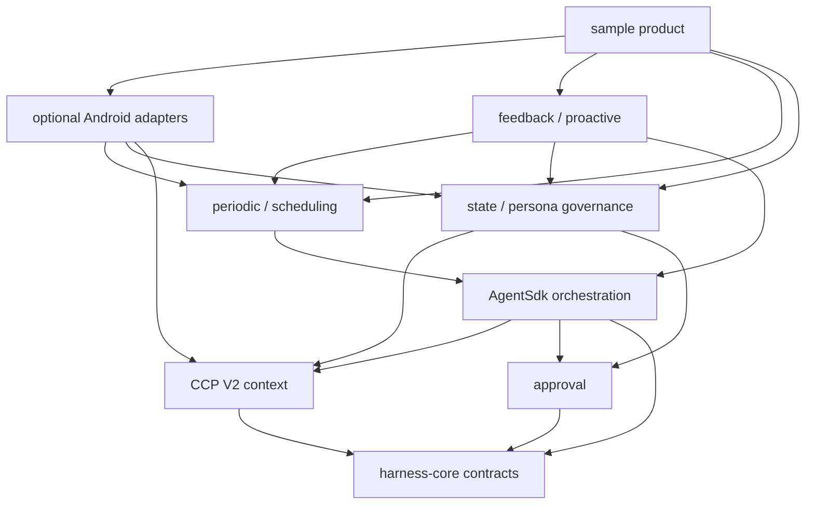

# SDK architecture

This document describes the implemented v0.4.0 boundaries. The longer [alignment plan](MIRROR_ANDROID_CORE_ALIGNMENT_PLAN.md) contains rationale, detailed data models, and acceptance criteria.

## Dependency direction



Platform-neutral modules do not depend on Android framework classes. Android adapters do not call a provider or progress a run. The sample composes public interfaces and owns product choices.

## Seven layers

### 1. Orchestration

Modules: `harness-core`, `agent-sdk`, `provider-openai`.

Responsibilities:

- single provider/tool run kernel;
- lifecycle and stable event stream;
- per-session concurrency fence and global concurrency bound;
- cancellation, deadline, repeated-failure, provider-step, tool, and token budgets;
- transactionally committed session turns;
- provider connection isolation;
- tool capability and result envelope;
- trace sink, deterministic replay, and late-event fencing;
- attachment and streaming transport integration.

### 2. Context engine

Module: `context-engine`.

Responsibilities:

- analyze a `ContextNeedSpec`;
- collect typed candidates from named sources;
- apply trust, privacy, risk, capability, provenance, and freshness policy;
- resolve superseded facts and conflicts;
- select within token/item budgets and deterministically compress non-critical overflow;
- treat a requested but unregistered source as critical unavailable evidence;
- emit an `EvidencePack`;
- decide information routing through `RouteGate`;
- render host policy separately from untrusted context data.

This is the only prompt-context compiler. House, State, Todo, Stats, permissions, and files expose sources; they do not each build prompts.

### 3. Memory and persona

Module: `agent-state`, with House compatibility in `agent-sdk`.

Responsibilities:

- State Vault documents, events, evidence, effects, briefs, and psyche observations;
- memory, skill, and persona candidate sinks;
- dedupe, validation, evaluation, approval, promotion, revision, and rollback;
- approved-only context views;
- migration from House data;
- bounded observational retention and explicit deletion.

The model cannot directly modify approved memory, enabled skill, or persona policy.

### 4. Periodic business and scheduling

Modules: `agent-scheduling`, `agent-scheduling-android`.

Responsibilities:

- schedule/cadence/revision contracts;
- occurrence ids and authorization snapshots;
- leases, execution windows, jitter, and missed-run policy;
- explicit missed-run recovery semantics for skip, catch-up-once, and next-window;
- Cron targets and LongTask checkpoint bursts with per-burst budget and evidence/effect refs;
- WorkManager dispatch, boot/package-update restoration, and visible LongTask carrier;
- completed-occurrence chain repair and Stop/no-hidden-reschedule semantics.

This layer decides when reliable work may be attempted, not what the Agent should believe.

### 5. Feedback and proactive behavior

Module: `agent-feedback`.

Responsibilities:

- signal and outcome journals;
- bounded app-private file implementations for sample process-death recovery;
- opportunity scoring and dedupe;
- Heartbeat typed findings;
- Dream reflection proposals;
- Proactive initiative, quiet hours, and daily caps;
- Home Brief and Self Check.

It returns findings or activation requests. It never executes Android effects.

### 6. Approval

Module: `agent-approval`.

Responsibilities:

- classify effect requirements;
- bind approval to run, call, target, argument hash, capability scope, and expiry;
- fail closed on denial, timeout, unavailable UI, mismatch, or policy error;
- keep a decision journal;
- share one contract across Todo, schedules, State promotion/deletion, House reset, and Phone Use.

`RouteGate` controls information flow. `ApprovalGate` authorizes one concrete side effect. They are intentionally different types.

### 7. Android adapters

Modules: `agent-permission-android`, `agent-data-android`, `agent-scheduling-android`, `agent-sdk-android`, `device-loop-android`, `agent-voice-android`.

Responsibilities:

- typed permission and special-access state;
- Stats, Todo, local document, State/House, coarse location, calendar, and host-fed notification data;
- durable Android schedule/checkpoint/lease adapters;
- Accessibility observation/action and approval UI bridge;
- optional visual observation, sensor, STT, recording, and TTS surfaces.

Adapters expose availability instead of pretending missing permission is empty data.

## Primary flows

### User run

```text
host creates RunPolicy
  → AgentSdk opens isolated provider and session transaction
  → CCP V2 compiles EvidencePack and RouteGate decision
  → provider streams answer or requests a registered tool
  → approval binds a concrete mutating effect when required
  → tool returns a bounded envelope
  → provider finishes
  → session commits once
  → terminal event and outcome journal
```

### Candidate promotion

```text
model/agent proposes candidate
  → State Vault stores pending immutable candidate
  → validator and evaluator attach evidence/checks
  → approval binds candidate hash and target
  → promotion creates an active revision and rollback point
  → approved context source can expose the revision
```

### Scheduled run

```text
approved ScheduleSpec
  → Android backend enqueues unique occurrence
  → Worker verifies enabled revision/window/constraints
  → durable lease rejects duplicate
  → host PeriodicRunner enters AgentSdk
  → receipt and outcome are recorded
  → next enabled occurrence is calculated
```

### Phone Use

```text
provider calls device_observe
  → runtime records snapshot binding
  → one exact action is validated and optionally approved
  → action attempt invalidates snapshot
  → provider must observe again
  → finish requires fresh visible evidence
```

## Persistence domains

| Domain | Default sample adapter | Automatic retention |
| --- | --- | --- |
| Sessions | app-private files | host controlled |
| Agent House | app-private Markdown files | no silent durable deletion |
| State Vault | app-private snapshot file | bounded events/briefs/psyche and unreferenced expired evidence |
| Todo | app-private revisioned files | explicit archive/delete |
| Schedules | app-private revisioned file | explicit approved delete |
| Leases/checkpoints | app-private files | terminal/explicit maintenance |
| Credentials | Android Keystore-backed sample repository | explicit provider-settings delete |
| Trace journal | bounded process journal in sample | bounded by count; user can clear/export |
| Signal/outcome journals | app-private atomic files | signals: 30 days/2,000; outcomes: 90 days/1,000; user can clear |
| Image/audio raw data | ephemeral host-owned storage | TTL / immediate cleanup |

Production hosts can replace stores without changing the orchestration contracts.

## Known open review boundaries

This revision deliberately leaves three approval/security composition items open:

- Provider policy classification still accepts the textual `<policy-context` marker from direct callers.
- Schedule approval hashing does not bind every behavior-affecting `ScheduleSpec` field.
- The Android Phone Agent helper does not yet bridge its legacy approval gate into the generic run coordinator automatically.

## Compatibility gates

- JVM modules commit Kotlin ABI snapshots under each module's `api/` directory.
- `checkSdkAbi` compares current bytecode with those snapshots.
- `sdk-consumer-smoke` consumes all published JVM coordinates.
- `sdk-android-consumer-smoke` consumes all published AAR coordinates and their POM graph.
- unit and Android library tests cover state machines and stores.
- lint covers released AARs and the sample.
- instrumentation covers documented sample navigation and the quick-entry shadow regression.
- `auditProvenance` rejects credentials, private machine paths, product namespaces, and binary sample resources.

## Host responsibilities

The SDK deliberately does not choose:

- which credentials or endpoints are acceptable;
- which tools/capabilities are registered;
- what Android permissions the product declares;
- which high-risk targets require extra policy;
- how approval is presented;
- which schedules are enabled;
- whether data is encrypted, backed up, retained, exported, or deleted;
- whether optional visual, sensor, or voice capture is available.
